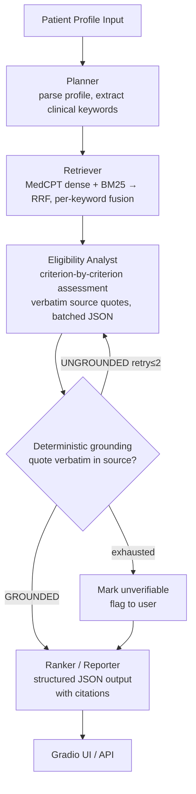

# TrialGuard

**Self-verifying, multi-agent clinical-trial eligibility intelligence.**

> *Faithfulness is the product.* Every eligibility verdict is backed by a verified citation from the source trial, or explicitly flagged as unverifiable.

Live demo: *(Phase 6 — not yet deployed)*

---

## Problem

Matching patients to clinical trials is a validated, largely unsolved bottleneck. The NIH's 2024 TrialGPT work (*Nature Communications*) and Mass General Brigham's RECTIFIER trial showed LLM-assisted screening can roughly double enrolment rates and cut screening time ~40%. The dangerous failure mode: an AI that confidently declares a patient *eligible* based on a hallucinated or misread criterion — a patient-safety issue, not a UX annoyance.

## Thesis

Analyst drafts a criterion-by-criterion assessment with quoted evidence; a **deterministic verifier** then checks every quote is verbatim in the source. A verdict survives only if its citation is real, else it retries (≤2) or is downgraded to *unverifiable* — never forced. Grounding is pure Python: it cannot hallucinate agreement and costs nothing, which is what makes faithfulness measurable rather than asserted.

---

## Architecture



### Component map

| Component | Technology | Cost |
|---|---|---|
| Orchestration | LangGraph | $0 |
| LLM inference | Groq free tier (Llama 3.3 70B) | $0 |
| Embeddings | MedCPT (768-dim, NCBI) on CPU/MPS | $0 |
| Lexical retrieval | BM25 (`rank-bm25`), RRF fusion | $0 |
| Vector store | pgvector on Neon free tier (production); numpy file index (eval) | $0 |
| Verification | deterministic quote grounding (pure Python) | $0 |
| Tracing | Langfuse free tier | $0 |
| Demo hosting | Hugging Face Spaces | $0 |
| **Total** | | **$0/month** |

---

## Data Sources

- **ClinicalTrials.gov API v2** — 500k+ studies, public domain, no auth, JSON
- **SIGIR 2016 patient–trial matching cohort** — 183 synthetic patients, published labels
- **TREC Clinical Trials 2021/2022** — 75k+ eligibility annotations (gold eval standard)

Scope locked to **oncology** trials (richest trial volume, best eval overlap).

All patient profiles in demos are **synthetic**. No real patient data enters this system.

---

## Measured results

Full report: [`data/reports/phase2_3_results.md`](data/reports/phase2_3_results.md). All numbers reproduced from code, $0 (Groq free tier + local embeddings).

**Retrieval — MedCPT vs BGE (SIGIR, keyword-RRF, n=53):** recall@10 0.135 → **0.180 (+34%)**, MRR 0.284 → **0.345 (+21%)**. MedCPT adopted as default.

**Retrieval — full-corpus honest test (MedCPT, ~26k trials, ~100% gold coverage):**

| Cohort | n | recall@50 | recall@100 | MRR |
|---|---|---|---|---|
| TREC 2021 | 75 | 0.289 | 0.426 | 0.562 |
| TREC 2022 | 50 | 0.313 | 0.464 | 0.667 |

**Faithfulness — verifier mechanism:** deterministic catch-rate stress test — **509/509 corrupted quotes rejected, 0 false rejections**. Sample-size-independent.

**Faithfulness — verified vs single-pass A/B (SIGIR):** single-pass unsupported-citation rate 9.16% (n=180 trials). Matched paired comparison (168 trials): **4.63% → 2.19%, −53% relative**, Fisher p=0.13 (trend; full significance pending verified-arm completion, quota-bound).

> **Note on `recall@10 ≥ 90%`:** retired as a target. It is mathematically capped at `min(10, |gold|)/|gold|` per patient — TREC patients average 60+ eligible trials (ceiling ~0.25). TrialGPT's ">90% recall" was measured at large depth. Primary retrieval metric is now **recall@pool** (recall@50/100).

## Metric targets

| Metric | Target | Status |
|---|---|---|
| Retrieval recall@pool (50/100) | maximize; beat BGE baseline | ✅ MedCPT adopted (+34% recall@10) |
| Verifier catch rate | 100% (deterministic) | ✅ 509/509 |
| Hallucination rate | < single-pass baseline (measured) | 🟡 trend (−53%, p=0.13), finishing verified arm |
| Correct-refusal rate ("cannot determine") | Logged per run | ✅ abstention reported jointly with accuracy |

---

## Development Phases

| Phase | Status | Artifact |
|---|---|---|
| 0 — Foundations | ✅ Done | Repo + README + env skeleton |
| 1 — Data ingestion | ✅ Done | Queryable corpus + parsed eval cohorts |
| 2 — Retrieval | ✅ Done | MedCPT hybrid retriever (recall/latency report) |
| 3 — Eval harness + agent | 🟡 In progress | Self-verifying graph + faithfulness A/B (finishing verified arm) |
| 4 — Agent tuning | ⬜ | Lower abstention, close A/B to significance |
| 5 — LLMOps | ⬜ | Tracing dashboards + regression gate |
| 6 — Demo & docs | ⬜ | Live HF Spaces demo + recorded walkthrough |

---

## Quickstart

```bash
git clone https://github.com/YOUR_USERNAME/TrialGuard
cd TrialGuard

python -m venv .venv && source .venv/bin/activate
pip install -e ".[dev]"

cp .env.example .env
# Fill in .env values (see .env.example for required keys)

pytest tests/
```

Run the evals:

```bash
# Retrieval sweep (MedCPT default; keyword-RRF)
python -m trialguard.scripts.eval_retrieval --cohort sigir --use-keywords

# Agent faithfulness: single-pass vs verified A/B
python -m trialguard.eval.agent_metrics --cohort sigir --n-patients 30 --per-class 3
```

> Groq free tier is capped at ~12k tokens/min and 100k tokens/day. A full agent A/B run exceeds the daily cap; the harness caches every analyst call by `(patient, trial, prompt_version)` and degrades gracefully on rate limits, so runs resume across days without re-spending. Set `TG_ANALYST_DELAY` to space calls under the TPM window.

---

## Key References

- Jin et al., *Matching patients to clinical trials with large language models* (TrialGPT), *Nature Communications*, 2024
- NIH/NLM TrialGPT dataset release — SIGIR 2016, TREC CT 2021/2022
- Mass General Brigham RECTIFIER randomised trial
- ClinicalTrials.gov API v2 documentation (NLM Technical Bulletin, 2024)

---

## Architectural Decision Log

| AD | Decision | Alternatives considered |
|---|---|---|
| AD-1 | LangGraph orchestration | LCEL chain, LlamaIndex, bespoke Python |
| AD-2 | Hybrid retrieval (dense + BM25) + RRF | Dense-only, keyword-only |
| AD-3 | Analyst → **deterministic grounding** with back-edge | LLM re-read verifier (correlated errors), self-consistency voting |
| AD-4 | Criterion-level structured JSON output | Free-text verdict, binary flag |
| AD-5 | MedCPT (768-dim) embeddings on CPU/MPS | MiniLM (0.49 recall ceiling), BGE (same ceiling), hosted API |
| AD-6 | pgvector (production) + numpy file index (eval) | Load 26k eval trials into Neon free tier (too small) |
| AD-7 | Groq free-tier hosted open model | Local quantised LLM, paid frontier API |
| AD-8 | Langfuse tracing from day one | Add logging later, print statements |
| AD-9 | Kaggle/Colab for batch jobs only | Always-on GPU, local only |
| AD-10 | Gradio on HF Spaces | FastAPI + React, Streamlit, local-only |
| AD-11 | LLM keyword extraction before retrieval | Raw patient narrative as query (semantic mismatch, recall ceiling) |

*When a decision is reversed during the build, the reversal and reason are recorded here — not deleted.*
