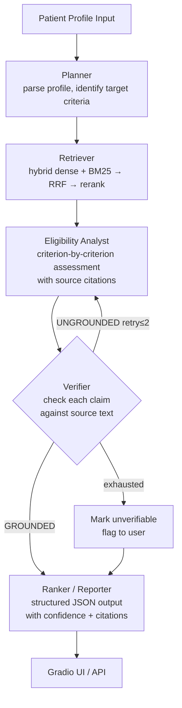

# TrialGuard

**Self-verifying, multi-agent clinical-trial eligibility intelligence.**

> *Faithfulness is the product.* Every eligibility verdict is backed by a verified citation from the source trial, or explicitly flagged as unverifiable.

Live demo: *(Phase 6 — not yet deployed)*

---

## Problem

Matching patients to clinical trials is a validated, largely unsolved bottleneck. The NIH's 2024 TrialGPT work (*Nature Communications*) and Mass General Brigham's RECTIFIER trial showed LLM-assisted screening can roughly double enrolment rates and cut screening time ~40%. The dangerous failure mode: an AI that confidently declares a patient *eligible* based on a hallucinated or misread criterion — a patient-safety issue, not a UX annoyance.

## Thesis

A two-agent system — Analyst drafts, Verifier independently validates each citation — drives hallucinated criteria toward zero. Every verdict is either grounded in source text or surfaced as unverifiable. The architecture makes this measurable.

---

## Architecture



### Component map

| Component | Technology | Cost |
|---|---|---|
| Orchestration | LangGraph | $0 |
| LLM inference | Groq free tier (Llama 3.1 70B) | $0 |
| Embeddings | `sentence-transformers` (MiniLM) CPU | $0 |
| Lexical retrieval | BM25 (`rank-bm25`) | $0 |
| Vector store | pgvector on Neon free tier | $0 |
| Tracing | Langfuse free tier | $0 |
| Demo hosting | Hugging Face Spaces | $0 |
| Eval GPU (batch) | Kaggle/Colab free notebooks | $0 |
| **Total** | | **$0/month** |

---

## Data Sources

- **ClinicalTrials.gov API v2** — 500k+ studies, public domain, no auth, JSON
- **SIGIR 2016 patient–trial matching cohort** — 183 synthetic patients, published labels
- **TREC Clinical Trials 2021/2022** — 75k+ eligibility annotations (gold eval standard)

Scope locked to **oncology** trials (richest trial volume, best eval overlap).

All patient profiles in demos are **synthetic**. No real patient data enters this system.

---

## Metric targets (Phase 4 baseline to beat)

| Metric | Target |
|---|---|
| Retrieval recall@10 | ≥ 90% (parity with TrialGPT) |
| Criterion-matching accuracy | ≥ 87% (TrialGPT published benchmark) |
| Hallucination rate | < single-pass baseline (measured) |
| Verifier catch rate | Logged per run |
| Correct-refusal rate ("cannot determine") | Logged per run |

---

## Development Phases

| Phase | Status | Artifact |
|---|---|---|
| 0 — Foundations | ✅ In progress | Repo + README + env skeleton |
| 1 — Data ingestion | ⬜ | Queryable corpus + parsed eval cohorts |
| 2 — Retrieval | ⬜ | Measured retriever (recall/latency report) |
| 3 — Eval harness | ⬜ | One-command eval + baseline numbers |
| 4 — Agent | ⬜ | Working system + before/after metrics |
| 5 — LLMOps | ⬜ | Tracing dashboards + regression gate |
| 6 — Demo & docs | ⬜ | Live HF Spaces demo + recorded walkthrough |

---

## Quickstart

```bash
git clone https://github.com/YOUR_USERNAME/TrialGuard
cd TrialGuard

python -m venv .venv && source .venv/bin/activate
pip install -e ".[dev]"

cp .env.example .env
# Fill in .env values (see .env.example for required keys)

pytest tests/
```

---

## Key References

- Jin et al., *Matching patients to clinical trials with large language models* (TrialGPT), *Nature Communications*, 2024
- NIH/NLM TrialGPT dataset release — SIGIR 2016, TREC CT 2021/2022
- Mass General Brigham RECTIFIER randomised trial
- ClinicalTrials.gov API v2 documentation (NLM Technical Bulletin, 2024)

---

## Architectural Decision Log

| AD | Decision | Alternatives considered |
|---|---|---|
| AD-1 | LangGraph orchestration | LCEL chain, LlamaIndex, bespoke Python |
| AD-2 | Hybrid retrieval (dense + BM25) + RRF | Dense-only, keyword-only |
| AD-3 | Two-pass Analyst → Verifier with back-edge | Single-pass, self-consistency voting |
| AD-4 | Criterion-level structured JSON output | Free-text verdict, binary flag |
| AD-5 | Small sentence-transformer on CPU | Hosted embedding API, large GPU model |
| AD-6 | pgvector on Neon free tier | Pinecone, Qdrant, FAISS flat file |
| AD-7 | Groq free-tier hosted open model | Local quantised LLM, paid frontier API |
| AD-8 | Langfuse tracing from day one | Add logging later, print statements |
| AD-9 | Kaggle/Colab for batch jobs only | Always-on GPU, local only |
| AD-10 | Gradio on HF Spaces | FastAPI + React, Streamlit, local-only |

*When a decision is reversed during the build, the reversal and reason are recorded here — not deleted.*
