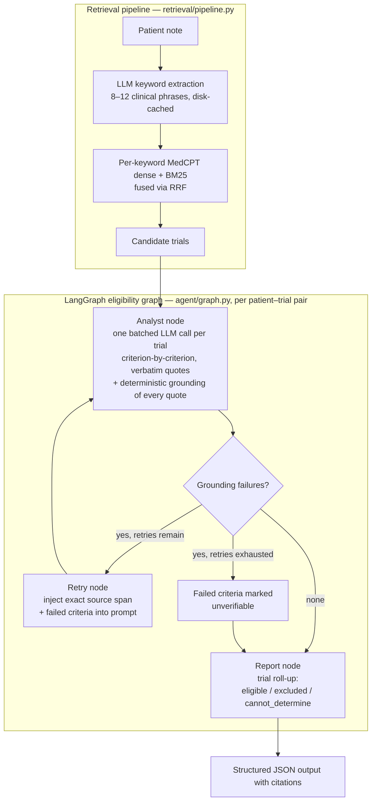

# TrialGuard

**Self-verifying, multi-agent clinical-trial eligibility intelligence.**

> *Faithfulness is the product.* Every eligibility verdict is backed by a verified citation from the source trial, or explicitly flagged as unverifiable.

Live demos:

- **Stage A web app** (live `ctgov_live` corpus, quote-in-source UI):
  [web-five-virid-38.vercel.app](https://web-five-virid-38.vercel.app) (frontend) —
  API at [trialguard-api.fly.dev](https://trialguard-api.fly.dev/api/health).
  Deploy guide [`docs/deploy_stage_a.md`](docs/deploy_stage_a.md).
- **Gradio** ($0 SIGIR `FileIndex` on HF Spaces): `app.py` — see [`docs/deploy.md`](docs/deploy.md).

---

## Problem

Matching patients to clinical trials is a validated, largely unsolved bottleneck. The NIH's 2024 TrialGPT work (*Nature Communications*) and Mass General Brigham's RECTIFIER trial showed LLM-assisted screening can roughly double enrolment rates and cut screening time ~40%. The dangerous failure mode: an AI that confidently declares a patient *eligible* based on a hallucinated or misread criterion — a patient-safety issue, not a UX annoyance.

## Thesis

Analyst drafts a criterion-by-criterion assessment with quoted evidence; a **deterministic verifier** then checks every quote is verbatim in the source. A verdict survives only if its citation is real, else it retries (≤2) or is downgraded to *unverifiable* — never forced. Grounding is pure Python: it cannot hallucinate agreement and costs nothing, which is what makes faithfulness measurable rather than asserted.

---

## Architecture

Two stages. Retrieval is a standalone pipeline (`retrieval/pipeline.py`), not a
graph node; the LangGraph graph (`agent/graph.py`) runs once per (patient, trial)
pair on the retrieved candidates.


```mermaid
flowchart TD
    subgraph RP [Retrieval pipeline — retrieval/pipeline.py]
        A[Patient note] --> B[LLM keyword extraction\n8–12 clinical phrases, disk-cached]
        B --> C[Per-keyword MedCPT dense + BM25\nfused via RRF]
        C --> D[Candidate trials]
    end
    subgraph EG [LangGraph eligibility graph — agent/graph.py, per patient–trial pair]
        D --> E[Analyst node\none batched LLM call per trial\ncriterion-by-criterion, verbatim quotes\n+ deterministic grounding of every quote]
        E --> F{Grounding failures?}
        F -- none --> G[Report node\ntrial roll-up:\neligible / excluded / cannot_determine]
        F -- yes, retries remain --> H[Retry node\ninject exact source span\n+ failed criteria into prompt]
        H --> E
        F -- "yes, retries exhausted" --> I[Failed criteria marked\nunverifiable]
        I --> G
    end
    G --> J[Structured JSON output with citations]
```

Graph nodes are `analyst`, `retry`, `report`. Deterministic grounding
(`verify/grounding.py`) runs inside the analyst node — every quote is checked
verbatim against the trial text and patient note — and the conditional edge
routes on its failures. Criteria are typed: inclusion `not_met` or exclusion
`met` excludes the trial; eligible only if every inclusion is `met` and every
exclusion is `not_met`. Prompt v4 labels each criterion with its kind. A Gradio
UI sits in front of this; retrieval is `FileIndex` (SIGIR) or the live
`ctgov_live` corpus, selected by `TG_DEMO_SOURCE`. On the production corpus the
per-keyword searches run concurrently, dense against an in-memory matrix and
lexical against Postgres FTS, falling back to pgvector until the matrix is
resident.

### Component map

| Component | Technology | Cost |
|---|---|---|
| Orchestration | LangGraph | free |
| LLM inference | DeepInfra (Llama 3.3 70B, FP8) — Groq free tier still runnable | **paid (~$0.10/$0.32 per 1M)** |
| Embeddings | MedCPT (768-dim, NCBI) on CPU/MPS | free (local) |
| Lexical retrieval | Postgres FTS (production); BM25 `rank-bm25` (eval); RRF fusion | free |
| Vector store | in-memory numpy matrix for dense search, pgvector on Neon as the store of record (production); numpy file index (eval/demo) | **paid (Neon)** |
| Verification | deterministic quote grounding (pure Python) | free |
| Tracing | Langfuse free tier | free tier |
| Demo hosting | Gradio on HF Spaces ($0 SIGIR); FastAPI + Next.js Stage A (live corpus) | free / small metered |

The vector-store row carries an expiry. Dense search runs from an in-process matrix
because at 26k rows the planner declines ivfflat and scans anyway — but matrix
latency is linear in corpus size while HNSW is flat, and the two cross near **50k
rows**. Production sits at 26,037, so roughly 2x of headroom
([AD-25](docs/adr/0025-matrix-hnsw-crossover.md)).

Two paid lines, both small. The production vector store: the 26k-trial oncology
corpus (531 MB) exceeds Neon's 512 MB free ceiling. And inference: the free tier's
100k-tokens/day cap, not its price, was what stalled two Phase 4 measurements for
weeks, so Phase 8 moved the analyst to a metered host. **Every eval run in this
repo — four A/Bs, 584 calls — cost $0.11 in total.** The demo still runs at $0 on
a free HF Spaces CPU.

---

## Data Sources

- **ClinicalTrials.gov API v2** — 500k+ studies, public domain, no auth, JSON
- **SIGIR 2016 patient–trial matching cohort** — 183 synthetic patients, published labels
- **TREC Clinical Trials 2021/2022** — 75k+ eligibility annotations (gold eval standard)

Production scope is **oncology** by default — what `ctgov_live` holds — but it is no
longer locked: `pull_trials` (the refresh) and `fetch_oncology_trials` (sampling)
take explicit `condition` and `statuses` overrides, so widening is a call-site decision
([AD-26](docs/adr/0026-oncology-scope-unlocked.md)). Widening is not free: the
all-conditions corpus is ~125k trials, which crosses the ~50k in-process-matrix
crossover in [AD-25](docs/adr/0025-matrix-hnsw-crossover.md), so scope and vector
index have to move together.

**The eval cohorts were never oncology-only**, which is a separate point and was
unstated until it was measured: 61 of TREC 2021's 75 scored topics never mention a
cancer term, so every headline below is **81% non-oncology** by patient count and by
gold volume ([AD-28](docs/adr/0028-specialty-split-of-published-numbers.md)).

All patient profiles in demos are **synthetic**. No real patient data enters this system.

---

## Measured results

Full reports: [`data/reports/phase2_3_results.md`](data/reports/phase2_3_results.md) (Phase 2/3), [`data/reports/phase4_agent.md`](data/reports/phase4_agent.md) (Phase 4), [`phase8_provider_parity.md`](data/reports/phase8_provider_parity.md) and [`phase8_carryover.md`](data/reports/phase8_carryover.md) (Phase 8), [`phase9v4_agent_trec_2021.json`](data/reports/phase9v4_agent_trec_2021.json) (Phase 9 v4 TREC). All numbers reproduced from code; the full Phase 8 measurement set reruns for ~$0.10.

**Phase 4 (complete, finished in Phase 8):** the faithfulness A/B p-value is computed in-harness (`eval/significance.py`) instead of by hand; abstention vs citation-precision is reported as a swept curve, not a single point (`min_tokens=2` sits at the knee, and abstention is analyst-driven, not a grounding artifact); the retry is retrieval-aware (hands the analyst the exact source span for failed criteria); and the analyst prompt is additively versioned. The v2 and TREC retry A/Bs were quota-blocked for weeks behind the Groq daily cap and ran once inference moved to a metered host — see the two findings below.

**Retrieval — MedCPT vs BGE (SIGIR, keyword-RRF, n=53):** recall@10 0.135 → **0.180 (+34%)**, MRR 0.284 → **0.345 (+21%)**. MedCPT adopted as default.

**Retrieval — full-corpus honest test (MedCPT, ~26k trials, ~100% gold coverage):**

| Cohort | n | recall@50 | recall@100 | MRR |
|---|---|---|---|---|
| TREC 2021 | 75 | **0.296** | **0.440** | **0.658** |
| TREC 2022 | 50 | 0.313 | 0.464 | 0.667 |

**Retrieval — keyword-importance decay (adopted 2026-09-04).** The extraction prompt ranks keywords most-to-least important and fusion discarded that ordering, counting all 24 lists equally. Weighting each keyword's lists by `1/i` — the aggregation TrialGPT publishes — is significant on both cohorts of record at the depths that matter: recall@100 +5.1% (p=0.0386) and recall@200 +6.1% (p=0.0014) on TREC 2021, +6.0% (p=0.0025) and +4.3% (p=0.0063) on TREC 2022. MRR rises with recall (0.626 → 0.658), so depth is not bought with head quality. R3 had tested the same lever at recall@50, where the effect is weakest and where its null reproduces exactly (p=0.2301); H1 is what moved the metric that matters to recall@100–200. Report: [`keyword_decay_findings.md`](data/reports/keyword_decay_findings.md).

**End-to-end — the number the thesis actually claims.** Retrieval recall and faithfulness each describe one stage; neither says whether a patient note in yields eligible trials out. Composed end to end (note → keywords → retrieval → agent → tiered roll-up), the system surfaces eligible trials at:

| Cohort | n | assessed pool | retrieval ceiling | **surfaced recall** | precision | pool base rate | lift |
|---|---|---|---|---|---|---|---|
| TREC 2021 | 20 | top-10 | 0.048 | 0.0276 | 0.689 | 0.429 | 1.60x |
| TREC 2021 | 20 | top-100 | 0.298 | **0.1770** | 0.555 | 0.345 | 1.61x |
| TREC 2022 | 20 | top-10 | 0.067 | 0.0430 | 0.698 | 0.547 | 1.28x |
| TREC 2022 | 20 | top-100 | 0.378 | **0.2580** | 0.533 | 0.369 | 1.45x |

**The assessed-pool size, not the embedding model, was the binding constraint.** A depth diagnostic showed gold trials are not missing from the candidate space — they are present and misordered (recall 0.766@500 on 2021, 0.788@500 on 2022, under 6% never ranked; median gold rank 130–180). Widening the pool handed to the agent from 10 to 100 lifts surfaced recall **6.4x / 6.0x** with no change to retrieval, prompt or verifier, and the agent's lift over its pool's own base rate stays flat-to-rising through the full 10x dilution — it filters at a constant rate rather than borrowing its precision from a rich pool. Reports: [`h1_pool_curve_trec2021.md`](data/reports/h1_pool_curve_trec2021.md), [`h1_pool_curve_trec2022.md`](data/reports/h1_pool_curve_trec2022.md). Quote the lift, not the raw precision: TREC's retrieved pool is already 34–55% gold-eligible. Deep pools are a serving-cost question (~$0.05 and ~10 min/patient at top-100), so the demo makes depth an explicit opt-in: search returns 5 candidates by default, or up to 25 with **Deep search** checked, and the UI quotes the measured cost and wait before you commit to it.

**Split by specialty, the two halves pull opposite ways.** The tables above are a
mix nobody had labelled, so the same patients were partitioned and each group scored
with `end_to_end.score` unchanged — no new data, groups composing to the published
aggregate by construction, $0 because every assessment was already cached.
**Retrieval is 54% better outside oncology** (recall@100 0.4701 vs 0.3052), which is
corpus density rather than model quality: 26k recruiting oncology trials compete for
the same slots with overlapping eligibility language. **The agent is better inside
it** — tiered lift 1.90x vs 1.61x, and faithfulness 2.6x cleaner (criterion
unverifiable 0.0138 vs 0.0355, zero self-referential citations across 621 grounded
criteria). The lift the thesis actually claims holds in **both** cells above the
published 1.60x, so nothing in the system's value depends on the patient having
cancer. Stated with its limit: 14 oncology patients, so the 1.90x carries roughly
±0.4. [`e3_findings.md`](data/reports/e3_findings.md),
[AD-28](docs/adr/0028-specialty-split-of-published-numbers.md).

**Retrieval under dilution.** Growing the haystack with 99,098 real all-conditions
trials takes recall@100 from 0.1759 to 0.1102 at **4.79x dilution** — retaining
62.6% where chance dilution would retain 20.9%, so **3.0x better than chance**, with
the same retention at k=50, 100 and 200. Dense-only on raw-note queries to isolate
the embedder, so the level is not a system number; the shape is the finding.
[`e1c_findings.md`](data/reports/e1c_findings.md).

**Faithfulness — verifier mechanism:** deterministic catch-rate stress test — **51/51 corrupted quotes rejected, 0 false rejections** (14 genuine quotes; artifact: [`data/reports/verifier_stress.json`](data/reports/verifier_stress.json)). Sample-size-independent.

**Faithfulness — verified vs single-pass A/B (matched paired):**

*Generic retry (Phase 3, "copy verbatim" nudge):*

| Cohort | matched n | single-pass | verified | Fisher p | |
|---|---|---|---|---|---|
| SIGIR | 179 | 9.26% | 3.38% | **0.0012** | ✅ significant (−64%) |
| TREC 2021 | 59 | 12.0% | 11.26% | 0.86 | ❌ null (−6%) |
| TREC 2022 | 60 | 12.3% | 9.40% | 0.54 | ❌ ns (−24%, underpowered) |

*Retrieval-aware retry (Phase 4 mechanism, measured in Phase 8 — injects the exact source span plus the failed criteria):*

| Cohort | matched n | single-pass | verified | Fisher p | |
|---|---|---|---|---|---|
| SIGIR | 177 | 9.30% | 2.92% | **0.0004** | ✅ significant (−68.6%) |
| TREC 2021 | 59 | 13.33% | 3.97% | **0.0103** | ✅ significant (−70.2%) |
| TREC 2022 | 60 | 14.84% | 4.95% | **0.0168** | ✅ significant (−66.7%) |

**Both TREC cohorts now reach significance.** The Phase 4 hypothesis was that the generic nudge only recovered *paraphrase* failures — which is why it worked on SIGIR and not TREC — while TREC's failures were verbatim misses needing the characters to copy from. Handing the analyst the source span confirms it.

> **Caveat, stated rather than buried:** the second table changed retry logic *and* inference provider together, so it is not a controlled experiment. The arms decompose the confound — baseline arms run no retry at all and barely moved (TREC 2021 12.0% → 13.3%, TREC 2022 12.3% → 14.8%), while verified arms diverged sharply. Had the host driven the improvement, the baselines would have moved too. The clean control (Phase 3 retry on the new host) is unrun and recorded as outstanding in [`phase8_carryover.md`](data/reports/phase8_carryover.md).

**The faithfulness floor holds regardless of cohort or host**: deterministic grounding catches 100% of ungrounded verdicts and forces them to *unverifiable* (51/51 corrupted-quote catch rate); a hallucinated citation never passes as grounded. What was cohort-dependent is whether a caught failure gets *fixed* by retry or converted to an honest *abstention*. Replication also surfaced and fixed a grounding bug (short clinical facts like "48 M", "EF was 25%" were rejected by a char-length guard, now a token guard).

> **What the citation does not prove, with a number (Phase 10 WS-5b).** Grounding settles *existence*, not *entailment*: a quote can be genuinely verbatim and still not establish the verdict it supports. On a seeded random sample of **50 grounded decisive verdicts** (25 per cohort, adjudicated on one question — does this quote establish this verdict, not is the verdict correct), **36% did not** (95% CI 24–50%; SIGIR 48%, TREC 2021 24%). The recurring shapes are evidence pointing the other way, one conjunct of a compound criterion, and an adjacent fact standing in for the required one. This is not a 36% error rate — the quote is real in every case and many of the verdicts are still right — it is the size of the gap between *cited* and *shown*. The machine-checkable subset of it (a quote that only restates its own criterion) is 0.12–0.37% and is recorded as `self_referential`. [AD-3](docs/adr/0003-deterministic-grounding.md) rules out an LLM verifier on correlated-error grounds, so this stays open rather than fixed. The standing counter-proposal is now much worse supported: a biomedical NLI checkpoint separates the classes 4.4x better than the general one and still has no operating point ([AD-29](docs/adr/0029-biomedical-nli-not-shippable.md)), and re-tested on **350 items** two architectures sit at AUC 0.58 and 0.61 with best precision within 0.14 of the base rate ([AD-32](docs/adr/0032-nli-route-at-350-items.md)) — though 86% of those labels are model-generated and lenient, so that result reorders the human labelling pass rather than closing the route. Items, per-item reasons and caveats: [`ws5b_entailment_sample.json`](data/reports/ws5b_entailment_sample.json), [`ws5_guardrails_findings.md`](data/reports/ws5_guardrails_findings.md).

> **The patient note is a grounding source, and that cannot be removed (Phase 10 WS-5a).** Restricting decisive verdicts to quotes found in the *trial's* text was measured on both cohorts and rejected: **84% of grounded quotes exist only in the patient note** (SIGIR 458/545, TREC 673/818), because the evidence that a patient satisfies a criterion lives in the patient record while the trial states only the requirement. Enforcing it raised the criterion unverifiable rate from 3.1% to 42.6% (SIGIR) and 3.5% to 50.0% (TREC) and emptied the `eligible` tier entirely. So the honest statement of the contract is: *a quote is verified to appear verbatim in the inputs, and for patient facts the input is the user's note.* A user who states false facts gets verdicts faithful to those false facts — garbage-in, not hallucination, and indistinguishable to any verifier reading the same note. What ships is visibility: `grounded_in` per assessment, `note_only_grounded` per request, and the flag kept behind `TG_GROUND_TRIAL_ONLY` (default off) so the measurement is reproducible.

**Prompt v2 — lowering abstention did not cost faithfulness** (SIGIR, same host, 180 trials, verified arm):

| | v1 | v2 |
|---|---|---|
| citation precision | 0.9713 | **0.9896** |
| abstention | 0.7047 | **0.6543** |
| coverage | 0.2953 | **0.3457** |
| trial accuracy | 0.2611 | **0.3778** |

The open question was whether abstaining less would mean committing to shakier verdicts. It did not — abstention fell 5.0pp while citation precision *rose*, which suggests v1's abstention was largely the analyst declining to look for evidence it could have found. Retry stays significant on top of v2 (p=0.0006), so the prompt and the verifier address different failure modes.

**Exclusion criteria (prompt v4).** Prior prompts scored inclusion only, so a
correct exclude was structurally impossible. v4 types each criterion and the
roll-up inverts exclusion semantics. SIGIR cannot measure that change: the
corpus has no `exclusion criteria:` header, so `by_kind.exclusion.n_criteria`
is 0 on [`phase9v4_agent_sigir.json`](data/reports/phase9v4_agent_sigir.json).
That rerun measures the `MAX_CRITERIA` 12→24 lift, not exclusion handling
(verified trial accuracy 0.2611 → 0.3722; unsupported-verdict rate 0.0287 →
0.0966; retry still significant, −34.7%, p=0.0132).

> **Update 2026-08-31.** The missing header was worse than "SIGIR cannot measure
> exclusions". SIGIR strips the words `exclusion criteria` and leaves a bare `:`
> (2,666 of 2,991 trials), so all 36,826 criteria were filed as *inclusions* and a
> correct "patient does not have <disqualifier>" verdict read as a failed
> requirement — silently excluding trials the patient was eligible for. Fixed in
> `c8d9779`; SIGIR now parses 17,090 inclusion + 19,736 exclusion, sum conserved.
> **The trial-accuracy figures in this paragraph predate that fix and are not
> reproducible against current code.** Faithfulness figures are unaffected —
> grounding checks quotes against source text and never consults criterion kind.
> TREC 2021 remains the cohort of record ([`e1b_findings.md`](data/reports/e1b_findings.md)).

TREC 2021 is the cohort that contains exclusion text
([`phase9v4_agent_trec_2021.json`](data/reports/phase9v4_agent_trec_2021.json),
30 patients, 180 trials, $0.083). Verified arm, split by kind:

| Kind | Criteria | Unsupported rate | Citation precision |
|---|---|---|---|
| Inclusion | 1305 | 9.2% | 0.908 |
| Exclusion | 691 | **31.2%** | 0.688 |

Retry vs single-pass on that mix is not significant (−10%, Fisher p=0.2514).
About 71% of remaining unsupported decisive verdicts are exclusion. Inclusion
on TREC (9.2%) matches SIGIR v4 inclusion (9.7%); the aggregate drop is
exclusion quoting, not a harder inclusion task.

**Diagnosed and fixed in v5** ([`phase9v5_exclusion_grounding.md`](data/reports/phase9v5_exclusion_grounding.md)).
Every exclusion failure in a sampled trace was one pattern, and none were
hallucinations: an exclusion criterion answered `not_met` asserts the patient does
*not* match a disqualifier, which is a claim about **absence of evidence** that no
verbatim span can support. The analyst could only return an empty quote or write a
negation like "No mention of hepatocellular carcinoma", and the verbatim check
scored correct reasoning as unfaithful. Verbatim grounding is well defined for
presence claims and undefined for absence claims.

Absence is now verified mechanically rather than exempted (exempting it would be a
hallucination loophole): the criterion's distinctive terms must be genuinely
absent from the patient note. If a term is present a quotable span exists and the
verbatim requirement still applies, so a fabricated negation cannot pass. Same
cohort, 180 trials, verified arm:

| Kind | Criteria | Unsupported v4 → v5 | Precision v4 → v5 |
|---|---|---|---|
| Inclusion | 1294 | 9.2% → 8.0% | 0.908 → 0.920 |
| Exclusion | 696 | **31.2% → 8.9%** | 0.688 → **0.911** |

Exclusion now matches inclusion instead of trailing it threefold, and **retry
significance is restored on TREC 2021**: −10.1% (p=0.2514, ns) → **−31.9%
(p=0.0048)**, matched n=176. Trial accuracy 0.433 → 0.450, now above the baseline
arm (0.444) rather than below it. Both arms improve because the change is to the
verifier, which runs in the baseline arm too; significance returns because the
retry now has groundable failures to work on instead of structurally unfixable
ones. v5 is a fresh run (the v4 analyst cache was lost with the EC2 instance), so
inclusion's +1.2pp with no logic change affecting it marks the run-to-run noise
floor — the exclusion move is an order of magnitude outside it.

SIGIR is unaffected by construction: it yields zero exclusion criteria, so the
absence path never fires and every committed inclusion-only result is untouched.
The CI gate stays anchored to Phase 8 SIGIR
(`verified.unsupported_verdict_rate` 0.0287, threshold 0.05); the TREC reports
(v4 0.184, v5 0.084) are not a new baseline.

**The verifier is independent of the model, measured across six families.** Every
faithfulness figure above came from one model family, which made the architecture
claim an assertion at n=1. Re-run on SIGIR under prompt v4 across **six families
from five vendors spanning 24B to 671B**:

| model | vendor | baseline → verified | relative | Fisher p |
|---|---|---|---|---|
| Llama-3.3-70B | Meta | 0.0709 → 0.0426 | −39.9% | 0.0319 |
| Qwen2.5-72B | Alibaba | 0.0698 → 0.0337 | −51.7% | 0.0039 |
| Mistral-Small-24B | Mistral | 0.0507 → 0.0152 | −70.1% | 0.0152 |
| Gemma-3-27B | Google | 0.1366 → 0.0894 | −34.6% | 0.0083 |
| gpt-oss-120b | OpenAI | 0.0902 → 0.0112 | **−87.6%** | **0.0000** |
| DeepSeek-V3 | DeepSeek | 0.0404 → 0.0120 | −70.3% | 0.0155 |

**Six of six significant**, the whole matrix cost **$0.5210**, and it needed no code
change because Phase 8 had already made `(provider, model)` a value the system reads.
What moves is the verifier's workload: the rate at which a model attempts a decisive
verdict on a non-verbatim quote varies **8.1x** across the set (1.10% to 8.87%).
What reaches a user does not move at all, because grounding forces every ungrounded
verdict to `unverifiable` on a code path that never learns which model produced the
quote. Trial accuracy follows coverage rather than citation precision — Llama leads
at 0.2584 with the second-worst citations — so no model can be ranked on
faithfulness alone. [`e2_findings.md`](data/reports/e2_findings.md),
[AD-27](docs/adr/0027-verifier-independent-of-model.md).

**Provider parity.** Inference moved to an FP8-quantized build, which changes numerical precision on the model that produces verbatim quotes — a failure that would be *silent*, since a paraphrased quote just fails grounding and downgrades to *unverifiable*, a legitimate output. Measured rather than assumed: on a matched 180-trial baseline arm, citation precision was unchanged (0.9057 → 0.9086). [`phase8_provider_parity.md`](data/reports/phase8_provider_parity.md)

> **Note on `criterion-matching accuracy ≥ 87%`:** retired as a target (2026-08-31). It was never measurable here — every label in SIGIR and both TREC cohorts is trial-level (`qrels`: 0=irrelevant, 1=excluded, 2=eligible), and no criterion-level gold exists. Trial-level roll-up had been standing in for it, which answers a different question. The claim in its place is **faithfulness** (2.76% unverifiable on SIGIR, 3.95% on TREC 2021; verifier catch rate 100%) plus the **tiered contract** — trials separate into `eligible` / `needs_review` / `excluded`, where `needs_review` means no disqualifier and N unstated facts. Worth **1.60x lift over base rate on TREC, 1.39x on SIGIR** ([`e1b_findings.md`](data/reports/e1b_findings.md)); quote the lift, not raw precision, because TREC's retrieved pool is already 42.9% gold-eligible.

> **Note on `recall@10 ≥ 90%`:** retired as a target. It is mathematically capped at `min(10, |gold|)/|gold|` per patient — TREC patients average 60+ eligible trials (ceiling ~0.25). TrialGPT's ">90% recall" was measured at large depth. Primary retrieval metric is now **recall@pool** (recall@50/100).

### Serving latency (Stage A, live `ctgov_live`)

> **`780 ms` describes the demo's preset buttons, not the product.** A user who
> pastes their own note pays LLM keyword extraction first: **median 10,973 ms, worst
> 19,130 ms**, of which 94% is that one stage while retrieval is unchanged at ~590
> ms. Caching keywords for the presets made the demo fast without making the product
> fast. The warm path below is real and is what a repeat query costs.
> [`e6_findings.md`](data/reports/e6_findings.md).

Measured end to end against the deployed API, same synthetic note and same 12
extracted keywords throughout, so each figure is comparable to the one above it.

| Change | Search (warm) |
|---|---|
| Starting point | 24,382 ms |
| API moved to `syd`, beside Neon (`ap-southeast-2`) | 3,800 ms |
| Per-keyword searches fanned out concurrently | 2,796 ms |
| Dense retrieval served from an in-memory matrix | **780 ms** |

**31× overall**, and the rankings are byte-identical at every step — verified by
re-running the same query across each switch, because a speedup that changes
which trials a patient is shown is a regression wearing a win's clothing.

Four causes, each measured rather than guessed, and none of them the first
suspect:

- **Geography, not query cost.** The app ran in `iad` while Neon sat in Sydney.
  One search issues 60 round trips — 12 keywords × (dense + lexical), each with
  its `SET LOCAL`, `SELECT` and `COMMIT` — so ~250 ms of distance was ~15 s of
  the 24 s. Isolated by timing `/api/health` (one `SELECT 1`) against
  `/api/budget` (no database): the gap was 940 ms, and is now ~0.
- **Serialisation.** The per-keyword loop waited on each round trip in turn.
  Worth 2.26× locally but only 1.49× deployed: once the network was gone the
  queries were bound by Neon's CPU, not by latency, and past four concurrent
  workers contention cost more than overlap won.
- **The vector index was never used.** `EXPLAIN` shows a sequential scan: the
  planner declines ivfflat at `probes=40`, because probing 40 of 161 lists costs
  more than reading the table. pgvector was doing exact search all along, so
  moving that scan into an 80 MB in-process matrix computes the same answer
  60–85× faster per query (3.8–6.7 ms vs 320–413 ms) — identical ordering, scores
  agreeing to 2.8e-07.
- **Image weight at boot.** `sentence-transformers` pulls torch, whose default
  Linux wheel bundles ~2 GB of CUDA libraries that a GPU-less machine never
  executes but must still page in. Boot 114 s → 79 s; image 3.2 GB → 893 MB.
  Diagnosed by noticing boot was identical on shared and performance CPUs, which
  rules out compute.

**The distribution, replacing an n=1 probe.** Over 40 warm requests at 6.5 s spacing,
40/40 HTTP 200: wall **p50 787.3 / p95 981.9 / p99 1106.3 ms**, server-side 703.8 /
859.3 / 1023.1. Nearest-rank, so every figure is an observed request, and the 1500 ms
SLO holds with headroom rather than by luck. **Concurrency buys almost nothing**:
across bursts sized to fit inside the per-IP budget, latency grows 1.84x / 3.55x /
6.80x at c=2/4/8 while throughput stays flat at 1.27–1.45 req/s, so search is
effectively serial — the 12-keyword fan-out already saturates the cores. Practical
capacity is **~1.4 searches/second, ~85/minute**, roughly 8 concurrent users. A load
test is impossible from one host at 10 req/min per IP; it would measure the limiter.
[AD-30](docs/adr/0030-served-latency-p95-and-capacity.md).

Dense retrieval no longer touches Postgres, which keeps the lexical half where a
GIN index answers in 7 ms. The matrix loads on a background thread in ~33 s and
search falls back to pgvector until it is resident, so the fast path is an
optimisation rather than a dependency; `/api/health` reports which one is
serving. It follows the corpus rather than snapshotting it: every refresh that
changes the corpus publishes a new version, and a search more than 5 minutes after
the last check triggers a background reload that is swapped in atomically.
Measured on the first production publish, 26,107 rows reloaded in 6.9 s with no
restart ([AD-33](docs/adr/0033-refresh-write-audit-publish.md)). An idle process
stays on the old matrix until its next search, which serves nobody stale results.
Past roughly a million rows the matrix stops fitting and a real ANN index
earns its keep.

---

## Metric targets

| Metric | Target | Status |
|---|---|---|
| Retrieval recall@pool (50/100) | maximize; beat BGE baseline | ✅ MedCPT adopted (+34% recall@10) |
| Verifier catch rate | 100% (deterministic) | ✅ 51/51 ([`verifier_stress.json`](data/reports/verifier_stress.json)) |
| Hallucination rate | < single-pass baseline (measured) | ✅ all three cohorts: SIGIR −68.6% (p=0.0004), TREC 2021 −70.2% (p=0.0103), TREC 2022 −66.7% (p=0.0168) |
| Correct-refusal rate ("cannot determine") | Logged per run | ✅ abstention reported jointly with accuracy |
| Verifier independence | contract holds regardless of model | ✅ retry significant on 6/6 families, 5 vendors, 24B–671B ([AD-27](docs/adr/0027-verifier-independent-of-model.md)) |
| Served search latency | p95 under the 1500 ms SLO | ✅ p95 981.9 ms wall / 859.3 ms server, n=40 ([AD-30](docs/adr/0030-served-latency-p95-and-capacity.md)) |
| Cold-keyword path | reported, not hidden | ⚠️ 10,973 ms median on an unseen note — 14x the warm path |

---

## Development Phases

| Phase | Status | Artifact |
|---|---|---|
| 0 — Foundations | ✅ Done | Repo + README + env skeleton |
| 1 — Data ingestion | ✅ Done | Queryable corpus + parsed eval cohorts |
| 2 — Retrieval | ✅ Done | MedCPT hybrid retriever (recall/latency report) |
| 3 — Eval harness + agent | ✅ Done | Self-verifying graph + significant faithfulness A/B (−64%, p=0.0012) |
| 4 — Agent tuning | ✅ Done | v2 prompt cuts abstention at higher coverage *and* precision; retrieval-aware retry reaches significance on all three cohorts; in-harness significance + coverage/faithfulness curve. Final A/Bs completed in Phase 8 |
| 5 — LLMOps & hardening | ✅ Done | CI regression gate (100% verifier catch rate + committed faithfulness floors + frozen-prompt hash, all offline/$0); Langfuse run-level quality scores + dashboard spec; Groq daily token-budget with graceful cached-only degradation; OWASP LLM hardening (out-of-band injection defense proven, output-schema validation, synthetic-data guard); prompt registry. pgvector-vs-managed benchmark compute-paced |
| 6 — Demo & docs | ✅ Done | Gradio demo (`app.py`) + cost-engineering write-up + deploy guide; HF Spaces deploy + recorded walkthrough user-gated |
| 7 — Production corpus | ✅ Done | 25,965 recruiting oncology trials in pgvector; lexical BM25 → Postgres FTS (tsvector + GIN, indexes exclusion too); hybrid stack validated vs gold (recall@100 non-regressing, recall@10 +0.043); ivfflat probes retuned 20→40; resumable ingest + safe corpus refresh. Report: [`data/reports/phase7_retrieval.md`](data/reports/phase7_retrieval.md) |
| 8 — Provider migration & cost ops | ✅ Done | Provider-agnostic LLM layer; analyst cache keyed by (provider, model) with a legacy carve-out so committed Phase 3/4 entries are never orphaned; USD cost ledger with a daily circuit breaker, billed from the provider's reported cost; FP8 parity gate before adopting the new host; the two quota-blocked Phase 4 A/Bs completed for $0.10. Reports: [`phase8_provider_parity.md`](data/reports/phase8_provider_parity.md), [`phase8_carryover.md`](data/reports/phase8_carryover.md) |
| 9 — Close the production loop | ✅ Done (Stage A) | Typed inclusion+exclusion (prompt v4) and inverted trial roll-up; Gradio hits `ctgov_live` behind `TG_DEMO_SOURCE` (SIGIR `FileIndex` remains the $0 default); FastAPI Stage A (`src/trialguard/api/`) + Next.js (`web/`) wrap `retrieve()` / `assess()` unchanged with search/assess split, SSE, and quote-in-source highlighting. TREC 2021 v4 exclusion caveat (unsupported 31.2% vs 9.2% inclusion, retry ns at p=0.2514) resolved by absence grounding: exclusion 8.9%, retry significant at p=0.0048 ([`phase9v5_exclusion_grounding.md`](data/reports/phase9v5_exclusion_grounding.md)). Deploy: [`docs/deploy_stage_a.md`](docs/deploy_stage_a.md); retrieval latency 24.4 s → 780 ms end to end (region, concurrency, in-memory dense index) with rankings unchanged; spend ledger and keyword cache moved to Postgres; served path traced to Langfuse |
| 10 — Reliability | ✅ Done | Jobs and their events in Postgres with `Last-Event-ID` SSE resume, so a killed machine loses no completed work and a disowned worker stops spending ([AD-13](docs/adr/0013-orphaned-jobs-fail-visibly.md) and its two amendments); corpus refresh on a Fly scheduled machine recreated by `scripts/deploy_api.sh` on every deploy, diffing on `lastUpdatePostDate` so revised eligibility text is re-embedded rather than served stale; a live-endpoint probe (`eval/served_probe.py`) because a trace-reading monitor is blind exactly when the API is down, plus the monitor armed to fail rather than skip on a missing secret; a 240 s per-trial deadline — the real bound was ~27 min, since `TG_LLM_TIMEOUT` is per HTTP attempt and both the provider client and the graph retry; latency SLO enforced post-deploy, which is how the **20,576 ms first search after a resume from suspend** was found ("780 ms warm" is the steady state, not what a user meets); per-request faithfulness on the `done` event and the trace; a 13-case failure-injection suite. Two guardrail experiments returned negatives and are recorded as such: trial-only grounding ([AD-14](docs/adr/0014-patient-note-stays-a-grounding-source.md)) and prompt v5 ([AD-16](docs/adr/0016-prompt-v5-not-adopted.md)). Reports: [`ws5_guardrails_findings.md`](data/reports/ws5_guardrails_findings.md), [`l1_findings.md`](data/reports/l1_findings.md) |
| 11 — Limits, measured | ✅ Done | Seven experiments turning standing assumptions into measurements, two of which inverted the assumption. The in-process matrix expires at ~50k rows and production sits at 26k ([AD-25](docs/adr/0025-matrix-hnsw-crossover.md)); retrieval survives 4.79x dilution at 3.0x better than chance ([`e1c_findings.md`](data/reports/e1c_findings.md)); the retry holds on 6 model families from 5 vendors for $0.52 ([AD-27](docs/adr/0027-verifier-independent-of-model.md)); the published cohort numbers were 81% non-oncology all along and retrieval is *better* outside oncology ([AD-28](docs/adr/0028-specialty-split-of-published-numbers.md)); the served API gets a p95 and a capacity number, and the cold path a real user meets is 14x the advertised one ([AD-30](docs/adr/0030-served-latency-p95-and-capacity.md)); the job engine moves out of the HTTP layer as a verified-identical refactor; the CI gate is widened until it can fail, which caught production asserts, 21 silently truncating zips and live CVEs in the request path ([AD-31](docs/adr/0031-ci-gates-widened.md)); and the NLI route is re-tested at 350 items ([AD-32](docs/adr/0032-nli-route-at-350-items.md)). Reports: [`e1a_findings.md`](data/reports/e1a_findings.md), [`e2_findings.md`](data/reports/e2_findings.md), [`e3_findings.md`](data/reports/e3_findings.md), [`e5_findings.md`](data/reports/e5_findings.md), [`e6_findings.md`](data/reports/e6_findings.md), [`e7_nli350_findings.md`](data/reports/e7_nli350_findings.md) |
| 12 — Pipeline hardening | ✅ Done | The corpus refresh becomes write-audit-publish over content hashes ([AD-33](docs/adr/0033-refresh-write-audit-publish.md)). The old refresh trusted whatever the crawl returned: a crawl that stopped early read as mass expiry, and nothing checked content. A crawl is now accepted only when it is proven complete (`countTotal` plus an unchanged `/version`), and 26,107/26,107 trials arrive in 27 requests where ~260 were needed before. Every row records `doc_hash`, `embed_tag` and `parser_version`, and a trial is re-embedded only when its embedded text moves. Expiry is soft and confirmed by CT.gov id lookup. Hard audit gates always block, and the calibrated ones log until they are enforced. Publishing is one transaction, with a run ledger, a lease and an hourly `/version` short-circuit. **The first production run found 4,537 trials (17.4%) serving criteria from older parser versions**, with byte-identical raw text that the date diff could never have caught. It re-embedded them and published in 79 min, expired 15 trials with confirmed statuses, and corrected `healthy_volunteers` on 2,007 trials (API v2 sends a boolean; `== "Yes"` had read every one as False). The serving matrix reloads on publish, and the probe now alerts on the second consecutive failed refresh. |

---

## Quickstart

```bash
git clone https://github.com/YOUR_USERNAME/TrialGuard
cd TrialGuard

python -m venv .venv && source .venv/bin/activate
pip install -e ".[dev]"

cp .env.example .env
# Fill in .env values (see .env.example for required keys)

pytest tests/
```

Run the evals:

```bash
# Retrieval sweep (MedCPT default; keyword-RRF)
python -m trialguard.scripts.eval_retrieval --cohort sigir --use-keywords

# Agent faithfulness: single-pass vs verified A/B (writes phase4_agent_<cohort>.json:
# in-harness Fisher significance + coverage/faithfulness curve)
python -m trialguard.eval.agent_metrics --cohort sigir --n-patients 30 --per-class 3

# v2 analyst prompt (targets over-abstention; additive, own cache namespace)
TG_PROMPT_VERSION=v2 python -m trialguard.eval.agent_metrics --cohort sigir --tag phase4v2

# v4: inclusion + exclusion (additive cache namespace; app.py defaults to v4)
TG_PROMPT_VERSION=v4 python -m trialguard.eval.agent_metrics --cohort sigir --tag phase9v4
```

The Phase 11 harnesses, none of which need the production database:

```bash
# Where the in-process matrix stops being the right answer (needs a local
# pgvector; never point --dsn at production)
python scripts/bench_ann_scale.py --dsn postgresql://... --sizes 100000,500000,1000000

# Does retrieval survive leaving oncology? Gold held fixed, haystack grown
python scripts/e1c_distractor_recall.py --fetch 100000   # then --embed, then --eval

# Split the published end-to-end numbers by patient specialty ($0 from cache)
python scripts/e3_specialty_split.py --cohort trec_2021 --top-k 10

# Latency distribution and capacity against the deployed API
python scripts/e6_latency_profile.py --n 40 --novel 5 --burst 2,4,8

# Draw and merge the entailment adjudication set (see docs/e7_adjudication_protocol.md)
python scripts/e7_entailment_sample.py --draw 300
```

> Inference defaults to DeepInfra (metered). Every analyst call is cached by `(prompt_version, provider, model, patient, trial)`, so a rerun costs nothing and an interrupted run resumes rather than repeats — a killed parity run replayed 92 calls for free. A daily USD cap (`llm/cost.py`) refuses calls past the ceiling instead of overspending, and a per-day history keeps the cost story auditable. Set `LLM_PROVIDER=groq` to reproduce Phase 3/4 from the committed Groq cache; the free tier's ~12k tokens/min and 100k tokens/day still apply on that arm, and `TG_ANALYST_DELAY` paces calls under the TPM window.

### Run the demo locally

```bash
pip install -e ".[demo]"
python app.py    # Gradio UI on http://localhost:7860
```

Pick a synthetic patient or paste a synthetic note; the app retrieves candidate
oncology trials and shows each criterion's verdict with its **verbatim citation**
and a grounded / *unverifiable* badge — the faithfulness thesis made visible.
Default retrieval is the self-contained SIGIR `FileIndex` (no database). Set
`TG_DEMO_SOURCE=ctgov_live` to hit the production corpus (needs `DATABASE_URL`).
Deploy to HF Spaces: [`docs/deploy.md`](docs/deploy.md).

### Run Stage A (FastAPI + Next.js)

```bash
pip install -e ".[web]"
export API_CORS_ORIGIN=http://localhost:3000
python -m trialguard.api          # http://localhost:8000

cd web && cp .env.example .env.local && npm install && npm run dev
# → http://localhost:3000
```

Search and assess are separate: ranked `ctgov_live` hits first, then user-chosen
NCT IDs stream over SSE. Trial detail highlights assessed quotes inside
`eligibility_raw` only when they appear verbatim. Deploy:
[`docs/deploy_stage_a.md`](docs/deploy_stage_a.md).

---

## Stack & cost

The stack leans on free tiers and local compute; two components are paid, both
small. Caching-first everything and a deterministic verifier (not a paid LLM judge)
keep the footprint to a small database and cents of inference.

The interesting cost lesson is that the binding constraint was never price. The
free tier's 100k-tokens/day ceiling blocked two Phase 4 measurements for weeks;
at metered rates the same work cost **$0.0958**. Free is not the same as cheap
when the limit is throughput.

- **Inference:** DeepInfra (Llama 3.3 70B, FP8) at ~$0.10/$0.32 per 1M tokens,
  adopted only after a parity gate confirmed quantization did not degrade verbatim
  quoting. A daily USD cap (`llm/cost.py`) refuses calls past the ceiling rather
  than overspending, billed from the provider's own reported cost instead of a
  local price table that can go stale. Every analyst call is cached by
  `(prompt_version, provider, model, patient, trial)` — the provider is part of
  the key because two hosts must never share an entry. The Groq free-tier arm
  stays runnable and reproduces Phase 3/4 from cache at $0.
- **Embeddings:** MedCPT (110M) on CPU/MPS — a one-time offline job, cached to `.npy`.
- **Verification:** deterministic quote grounding is pure Python. The faithfulness
  guarantee costs nothing and cannot be rate-limited.
- **Vector store:** pgvector on a paid Neon instance is the store of record for
  production (the 26k-trial corpus is 531 MB, over the 512 MB free ceiling), and
  serves the lexical half via Postgres FTS. Dense search runs against an 80 MB
  in-process matrix, because at 26k rows the planner declines the ivfflat index
  and scans the table anyway — so the same exact search is 60–85× faster done
  locally. Eval and the demo use numpy `FileIndex` and stay free. The size
  ceiling — not query speed — is why the corpora were split in the first place
  ([`phase5_vectorstore.md`](data/reports/phase5_vectorstore.md)).
- **CI:** six blocking gates — ruff across ten rule families, mypy over all 65 source
  files, tests with a 55% coverage floor against a measured 59-60%, the regression
  gate, secret hygiene, and a **blocking** dependency audit. Widening them caught
  `assert` used as a production state guard, 21 `zip` calls that truncate silently,
  and live CVEs in the served request path
  ([AD-31](docs/adr/0031-ci-gates-widened.md)). `requirements.lock` pins the exact
  environment the committed numbers were produced under.
- **CI cost:** the regression gate runs on committed artifacts only, so it makes no LLM
  calls and stays free on GitHub Actions.
- **Serving:** Gradio on a free HF Spaces CPU (SIGIR `FileIndex`, $0); Stage A
  FastAPI + Next.js for the live `ctgov_live` corpus (quote-in-source UI), with
  per-request / per-IP / daily USD caps. MedCPT runs on the API host, baked into
  the image so a cold boot does not download it. The API is pinned to `syd`
  beside Neon — the same machine in `iad` spent ~15 s per search on nothing but
  distance — and suspends when idle, snapshotting RAM so a resume skips the model
  load entirely. The daily spend ledger lives in Postgres and accumulates through
  an atomic upsert: as a JSON file behind a per-instance lock it lost 88% of
  concurrent spend, and reset on every deploy.

---

## Key References

- Jin et al., *Matching patients to clinical trials with large language models* (TrialGPT), *Nature Communications*, 2024
- NIH/NLM TrialGPT dataset release — SIGIR 2016, TREC CT 2021/2022
- Mass General Brigham RECTIFIER randomised trial
- ClinicalTrials.gov API v2 documentation (NLM Technical Bulletin, 2024)

---

## Architectural Decision Log

One file per decision in [`docs/adr/`](docs/adr/). Each records what was
decided, the alternatives weighed against it, and — where a decision was later
reversed or corrected — the amendment appended beneath rather than replacing
what it corrects.

**If you read four of them**, read [AD-3](docs/adr/0003-deterministic-grounding.md) (why the verifier is not an LLM), [AD-11](docs/adr/0011-llm-keyword-extraction.md) (what lifted retrieval off its ceiling), [AD-15](docs/adr/0015-entailment-gap-stated-not-closed.md) (the limit the citation does not cover), and [AD-25](docs/adr/0025-matrix-hnsw-crossover.md) (the size at which the current architecture expires).

| AD | Decision | |
|---|---|---|
| [AD-1](docs/adr/0001-langgraph-orchestration.md) | LangGraph orchestration |  |
| [AD-2](docs/adr/0002-hybrid-retrieval-rrf.md) | Hybrid retrieval with RRF fusion |  |
| [AD-3](docs/adr/0003-deterministic-grounding.md) | Deterministic grounding, not an LLM verifier |  |
| [AD-4](docs/adr/0004-criterion-level-structured-json.md) | Criterion-level structured JSON output |  |
| [AD-5](docs/adr/0005-medcpt-embeddings.md) | MedCPT embeddings on CPU/MPS |  |
| [AD-6](docs/adr/0006-pgvector-production-numpy-eval.md) | pgvector for production, numpy file index for eval | 3 amendments |
| [AD-7](docs/adr/0007-hosted-open-model.md) | A hosted open model for inference | 1 amendment |
| [AD-8](docs/adr/0008-langfuse-tracing-from-day-one.md) | Langfuse tracing from day one |  |
| [AD-9](docs/adr/0009-notebooks-for-batch-jobs-only.md) | Notebook GPUs for batch jobs only | 1 amendment |
| [AD-10](docs/adr/0010-gradio-and-stage-a-serving.md) | Gradio for the $0 demo, Stage A for the live corpus |  |
| [AD-11](docs/adr/0011-llm-keyword-extraction.md) | LLM keyword extraction before retrieval |  |
| [AD-12](docs/adr/0012-api-colocated-with-neon.md) | The API is pinned beside Neon |  |
| [AD-13](docs/adr/0013-orphaned-jobs-fail-visibly.md) | Orphaned assess jobs fail visibly | 2 amendments |
| [AD-14](docs/adr/0014-patient-note-stays-a-grounding-source.md) | The patient note stays a grounding source |  |
| [AD-15](docs/adr/0015-entailment-gap-stated-not-closed.md) | The entailment gap is stated with a number, not closed |  |
| [AD-16](docs/adr/0016-prompt-v5-not-adopted.md) | Prompt v5 measured and not adopted |  |
| [AD-17](docs/adr/0017-analyst-cannot-be-instructed-into-coverage.md) | The analyst cannot be instructed into full coverage |  |
| [AD-18](docs/adr/0018-coverage-fixed-on-the-retry-edge.md) | Skipped criteria are fixed on the retry edge |  |
| [AD-19](docs/adr/0019-weak-absence-badge.md) | A quote cannot prove absence, so the badge says so |  |
| [AD-20](docs/adr/0020-criterion-unanswered-counted-not-subtracted.md) | criterion_unanswered is counted, not subtracted |  |
| [AD-21](docs/adr/0021-missing-criteria-were-the-parser.md) | The missing criteria were mostly the parser |  |
| [AD-22](docs/adr/0022-parser-and-matching-fixes-measured.md) | Parser and matching fixes, measured together |  |
| [AD-23](docs/adr/0023-off-the-shelf-nli-not-the-answer.md) | An off-the-shelf NLI model is not the answer |  |
| [AD-24](docs/adr/0024-truncation-blocks-eligible.md) | Truncation blocks eligible and nothing else |  |
| [AD-25](docs/adr/0025-matrix-hnsw-crossover.md) | The in-process matrix expires at a measured corpus size |  |
| [AD-26](docs/adr/0026-oncology-scope-unlocked.md) | The oncology scope lock becomes a parameter |  |
| [AD-27](docs/adr/0027-verifier-independent-of-model.md) | Faithfulness is a property of the architecture |  |
| [AD-28](docs/adr/0028-specialty-split-of-published-numbers.md) | The published numbers were never oncology numbers |  |
| [AD-29](docs/adr/0029-biomedical-nli-not-shippable.md) | A biomedical NLI checkpoint is still not shippable |  |
| [AD-30](docs/adr/0030-served-latency-p95-and-capacity.md) | The served API has a p95 and a capacity number |  |
| [AD-31](docs/adr/0031-ci-gates-widened.md) | The CI gate is widened until it can fail |  |
| [AD-32](docs/adr/0032-nli-route-at-350-items.md) | The NLI route re-tested at 350 items |  |
| [AD-33](docs/adr/0033-refresh-write-audit-publish.md) | The corpus refresh is write-audit-publish over content hashes |  |

*When a decision is reversed during the build, the reversal and reason are recorded — not deleted.*

## License

[MIT](LICENSE) — code and documentation.

The evaluation data under `data/eval/` is redistributed from its original
sources and stays under their terms: the SIGIR 2016 cohort from
[TrialGPT](https://github.com/ncbi-nlp/TrialGPT) (NCBI/NLM), and TREC Clinical
Trials 2021/2022 topics and qrels from [TREC-CDS](https://www.trec-cds.org/)
(NIST). Trial records come from ClinicalTrials.gov (U.S. National Library of
Medicine).

**Not a clinical decision tool.** Every patient note here is synthetic, and the
API enforces that rather than asking politely: `/api/search` and `/api/assess`
refuse a note carrying HIPAA Safe Harbor identifiers before any processing,
before any LLM call, and before anything reaches Langfuse. The refusal names the
identifier *classes* found and never echoes the values, so the gate cannot write
the PHI into the logs it exists to protect. Validated for zero false positives
across all 184 cohort notes ([`tests/test_phi.py`](tests/test_phi.py)).

It refuses rather than redacts on purpose: redaction would mean accepting real
PHI, processing it, and storing a modified copy of it, which is not what this
system tells its users it does.

This is a research artifact and must not be used to make or inform decisions
about the care of real patients.
