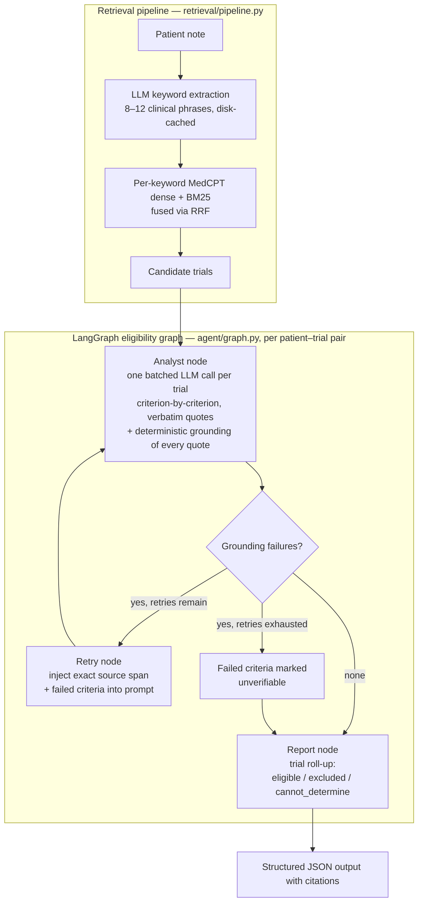

# TrialGuard

**Self-verifying, multi-agent clinical-trial eligibility intelligence.**

> *Faithfulness is the product.* Every eligibility verdict is backed by a verified citation from the source trial, or explicitly flagged as unverifiable.

Live demo: *(Gradio app built — `app.py`; HF Spaces deploy pending, see [`docs/deploy.md`](docs/deploy.md))*

---

## Problem

Matching patients to clinical trials is a validated, largely unsolved bottleneck. The NIH's 2024 TrialGPT work (*Nature Communications*) and Mass General Brigham's RECTIFIER trial showed LLM-assisted screening can roughly double enrolment rates and cut screening time ~40%. The dangerous failure mode: an AI that confidently declares a patient *eligible* based on a hallucinated or misread criterion — a patient-safety issue, not a UX annoyance.

## Thesis

Analyst drafts a criterion-by-criterion assessment with quoted evidence; a **deterministic verifier** then checks every quote is verbatim in the source. A verdict survives only if its citation is real, else it retries (≤2) or is downgraded to *unverifiable* — never forced. Grounding is pure Python: it cannot hallucinate agreement and costs nothing, which is what makes faithfulness measurable rather than asserted.

---

## Architecture

Two stages. Retrieval is a standalone pipeline (`retrieval/pipeline.py`), not a
graph node; the LangGraph graph (`agent/graph.py`) runs once per (patient, trial)
pair on the retrieved candidates.


```mermaid
flowchart TD
    subgraph RP [Retrieval pipeline — retrieval/pipeline.py]
        A[Patient note] --> B[LLM keyword extraction\n8–12 clinical phrases, disk-cached]
        B --> C[Per-keyword MedCPT dense + BM25\nfused via RRF]
        C --> D[Candidate trials]
    end
    subgraph EG [LangGraph eligibility graph — agent/graph.py, per patient–trial pair]
        D --> E[Analyst node\none batched LLM call per trial\ncriterion-by-criterion, verbatim quotes\n+ deterministic grounding of every quote]
        E --> F{Grounding failures?}
        F -- none --> G[Report node\ntrial roll-up:\neligible / excluded / cannot_determine]
        F -- yes, retries remain --> H[Retry node\ninject exact source span\n+ failed criteria into prompt]
        H --> E
        F -- "yes, retries exhausted" --> I[Failed criteria marked\nunverifiable]
        I --> G
    end
    G --> J[Structured JSON output with citations]
```

Graph nodes are `analyst`, `retry`, `report`. Deterministic grounding
(`verify/grounding.py`) runs inside the analyst node — every quote is checked
verbatim against the trial text and patient note — and the conditional edge
routes on its failures. A Gradio UI on HF Spaces sits in front of this in
Phase 6.

### Component map

| Component | Technology | Cost |
|---|---|---|
| Orchestration | LangGraph | free |
| LLM inference | DeepInfra (Llama 3.3 70B, FP8) — Groq free tier still runnable | **paid (~$0.10/$0.32 per 1M)** |
| Embeddings | MedCPT (768-dim, NCBI) on CPU/MPS | free (local) |
| Lexical retrieval | Postgres FTS (production); BM25 `rank-bm25` (eval); RRF fusion | free |
| Vector store | pgvector on Neon (production); numpy file index (eval/demo) | **paid (Neon)** |
| Verification | deterministic quote grounding (pure Python) | free |
| Tracing | Langfuse free tier | free tier |
| Demo hosting | Hugging Face Spaces | free tier |

Two paid lines, both small. The production vector store: the 26k-trial oncology
corpus (531 MB) exceeds Neon's 512 MB free ceiling. And inference: the free tier's
100k-tokens/day cap, not its price, was what stalled two Phase 4 measurements for
weeks, so Phase 8 moved the analyst to a metered host. **Every eval run in this
repo — four A/Bs, 584 calls — cost $0.11 in total.** The demo still runs at $0 on
a free HF Spaces CPU.

---

## Data Sources

- **ClinicalTrials.gov API v2** — 500k+ studies, public domain, no auth, JSON
- **SIGIR 2016 patient–trial matching cohort** — 183 synthetic patients, published labels
- **TREC Clinical Trials 2021/2022** — 75k+ eligibility annotations (gold eval standard)

Scope locked to **oncology** trials (richest trial volume, best eval overlap).

All patient profiles in demos are **synthetic**. No real patient data enters this system.

---

## Measured results

Full reports: [`data/reports/phase2_3_results.md`](data/reports/phase2_3_results.md) (Phase 2/3), [`data/reports/phase4_agent.md`](data/reports/phase4_agent.md) (Phase 4), [`phase8_provider_parity.md`](data/reports/phase8_provider_parity.md) and [`phase8_carryover.md`](data/reports/phase8_carryover.md) (Phase 8). All numbers reproduced from code; the full Phase 8 measurement set reruns for ~$0.10.

**Phase 4 (complete, finished in Phase 8):** the faithfulness A/B p-value is computed in-harness (`eval/significance.py`) instead of by hand; abstention vs citation-precision is reported as a swept curve, not a single point (`min_tokens=2` sits at the knee, and abstention is analyst-driven, not a grounding artifact); the retry is retrieval-aware (hands the analyst the exact source span for failed criteria); and the analyst prompt is additively versioned. The v2 and TREC retry A/Bs were quota-blocked for weeks behind the Groq daily cap and ran once inference moved to a metered host — see the two findings below.

**Retrieval — MedCPT vs BGE (SIGIR, keyword-RRF, n=53):** recall@10 0.135 → **0.180 (+34%)**, MRR 0.284 → **0.345 (+21%)**. MedCPT adopted as default.

**Retrieval — full-corpus honest test (MedCPT, ~26k trials, ~100% gold coverage):**

| Cohort | n | recall@50 | recall@100 | MRR |
|---|---|---|---|---|
| TREC 2021 | 75 | 0.289 | 0.426 | 0.562 |
| TREC 2022 | 50 | 0.313 | 0.464 | 0.667 |

**Faithfulness — verifier mechanism:** deterministic catch-rate stress test — **509/509 corrupted quotes rejected, 0 false rejections**. Sample-size-independent.

**Faithfulness — verified vs single-pass A/B (matched paired):**

*Generic retry (Phase 3, "copy verbatim" nudge):*

| Cohort | matched n | single-pass | verified | Fisher p | |
|---|---|---|---|---|---|
| SIGIR | 179 | 9.26% | 3.38% | **0.0012** | ✅ significant (−64%) |
| TREC 2021 | 59 | 12.0% | 11.26% | 0.86 | ❌ null (−6%) |
| TREC 2022 | 60 | 12.3% | 9.40% | 0.54 | ❌ ns (−24%, underpowered) |

*Retrieval-aware retry (Phase 4 mechanism, measured in Phase 8 — injects the exact source span plus the failed criteria):*

| Cohort | matched n | single-pass | verified | Fisher p | |
|---|---|---|---|---|---|
| SIGIR | 177 | 9.30% | 2.92% | **0.0004** | ✅ significant (−68.6%) |
| TREC 2021 | 59 | 13.33% | 3.97% | **0.0103** | ✅ significant (−70.2%) |
| TREC 2022 | 60 | 14.84% | 4.95% | **0.0168** | ✅ significant (−66.7%) |

**Both TREC cohorts now reach significance.** The Phase 4 hypothesis was that the generic nudge only recovered *paraphrase* failures — which is why it worked on SIGIR and not TREC — while TREC's failures were verbatim misses needing the characters to copy from. Handing the analyst the source span confirms it.

> **Caveat, stated rather than buried:** the second table changed retry logic *and* inference provider together, so it is not a controlled experiment. The arms decompose the confound — baseline arms run no retry at all and barely moved (TREC 2021 12.0% → 13.3%, TREC 2022 12.3% → 14.8%), while verified arms diverged sharply. Had the host driven the improvement, the baselines would have moved too. The clean control (Phase 3 retry on the new host) is unrun and recorded as outstanding in [`phase8_carryover.md`](data/reports/phase8_carryover.md).

**The faithfulness floor holds regardless of cohort or host**: deterministic grounding catches 100% of ungrounded verdicts and forces them to *unverifiable* (509/509 corrupted-quote catch rate); a hallucinated citation never passes as grounded. What was cohort-dependent is whether a caught failure gets *fixed* by retry or converted to an honest *abstention*. Replication also surfaced and fixed a grounding bug (short clinical facts like "48 M", "EF was 25%" were rejected by a char-length guard, now a token guard).

**Prompt v2 — lowering abstention did not cost faithfulness** (SIGIR, same host, 180 trials, verified arm):

| | v1 | v2 |
|---|---|---|
| citation precision | 0.9713 | **0.9896** |
| abstention | 0.7047 | **0.6543** |
| coverage | 0.2953 | **0.3457** |
| trial accuracy | 0.2611 | **0.3778** |

The open question was whether abstaining less would mean committing to shakier verdicts. It did not — abstention fell 5.0pp while citation precision *rose*, which suggests v1's abstention was largely the analyst declining to look for evidence it could have found. Retry stays significant on top of v2 (p=0.0006), so the prompt and the verifier address different failure modes.

**Provider parity.** Inference moved to an FP8-quantized build, which changes numerical precision on the model that produces verbatim quotes — a failure that would be *silent*, since a paraphrased quote just fails grounding and downgrades to *unverifiable*, a legitimate output. Measured rather than assumed: on a matched 180-trial baseline arm, citation precision was unchanged (0.9057 → 0.9086). [`phase8_provider_parity.md`](data/reports/phase8_provider_parity.md)

> **Note on `recall@10 ≥ 90%`:** retired as a target. It is mathematically capped at `min(10, |gold|)/|gold|` per patient — TREC patients average 60+ eligible trials (ceiling ~0.25). TrialGPT's ">90% recall" was measured at large depth. Primary retrieval metric is now **recall@pool** (recall@50/100).

## Metric targets

| Metric | Target | Status |
|---|---|---|
| Retrieval recall@pool (50/100) | maximize; beat BGE baseline | ✅ MedCPT adopted (+34% recall@10) |
| Verifier catch rate | 100% (deterministic) | ✅ 509/509 |
| Hallucination rate | < single-pass baseline (measured) | ✅ all three cohorts: SIGIR −68.6% (p=0.0004), TREC 2021 −70.2% (p=0.0103), TREC 2022 −66.7% (p=0.0168) |
| Correct-refusal rate ("cannot determine") | Logged per run | ✅ abstention reported jointly with accuracy |

---

## Development Phases

| Phase | Status | Artifact |
|---|---|---|
| 0 — Foundations | ✅ Done | Repo + README + env skeleton |
| 1 — Data ingestion | ✅ Done | Queryable corpus + parsed eval cohorts |
| 2 — Retrieval | ✅ Done | MedCPT hybrid retriever (recall/latency report) |
| 3 — Eval harness + agent | ✅ Done | Self-verifying graph + significant faithfulness A/B (−64%, p=0.0012) |
| 4 — Agent tuning | ✅ Done | v2 prompt cuts abstention at higher coverage *and* precision; retrieval-aware retry reaches significance on all three cohorts; in-harness significance + coverage/faithfulness curve. Final A/Bs completed in Phase 8 |
| 5 — LLMOps & hardening | ✅ Done | CI regression gate (100% verifier catch rate + committed faithfulness floors + frozen-prompt hash, all offline/$0); Langfuse run-level quality scores + dashboard spec; Groq daily token-budget with graceful cached-only degradation; OWASP LLM hardening (out-of-band injection defense proven, output-schema validation, synthetic-data guard); prompt registry. pgvector-vs-managed benchmark compute-paced |
| 6 — Demo & docs | ✅ Done | Gradio demo (`app.py`) + cost-engineering write-up + deploy guide; HF Spaces deploy + recorded walkthrough user-gated |
| 7 — Production corpus | ✅ Done | 25,965 recruiting oncology trials in pgvector; lexical BM25 → Postgres FTS (tsvector + GIN, indexes exclusion too); hybrid stack validated vs gold (recall@100 non-regressing, recall@10 +0.043); ivfflat probes retuned 20→40; resumable ingest + safe corpus refresh. Report: [`data/reports/phase7_retrieval.md`](data/reports/phase7_retrieval.md) |
| 8 — Provider migration & cost ops | ✅ Done | Provider-agnostic LLM layer; analyst cache keyed by (provider, model) with a legacy carve-out so committed Phase 3/4 entries are never orphaned; USD cost ledger with a daily circuit breaker, billed from the provider's reported cost; FP8 parity gate before adopting the new host; the two quota-blocked Phase 4 A/Bs completed for $0.10. Reports: [`phase8_provider_parity.md`](data/reports/phase8_provider_parity.md), [`phase8_carryover.md`](data/reports/phase8_carryover.md) |

---

## Quickstart

```bash
git clone https://github.com/YOUR_USERNAME/TrialGuard
cd TrialGuard

python -m venv .venv && source .venv/bin/activate
pip install -e ".[dev]"

cp .env.example .env
# Fill in .env values (see .env.example for required keys)

pytest tests/
```

Run the evals:

```bash
# Retrieval sweep (MedCPT default; keyword-RRF)
python -m trialguard.scripts.eval_retrieval --cohort sigir --use-keywords

# Agent faithfulness: single-pass vs verified A/B (writes phase4_agent_<cohort>.json:
# in-harness Fisher significance + coverage/faithfulness curve)
python -m trialguard.eval.agent_metrics --cohort sigir --n-patients 30 --per-class 3

# v2 analyst prompt (targets over-abstention; additive, own cache namespace)
TG_PROMPT_VERSION=v2 python -m trialguard.eval.agent_metrics --cohort sigir --tag phase4v2
```

> Inference defaults to DeepInfra (metered). Every analyst call is cached by `(prompt_version, provider, model, patient, trial)`, so a rerun costs nothing and an interrupted run resumes rather than repeats — a killed parity run replayed 92 calls for free. A daily USD cap (`llm/cost.py`) refuses calls past the ceiling instead of overspending, and a per-day history keeps the cost story auditable. Set `LLM_PROVIDER=groq` to reproduce Phase 3/4 from the committed Groq cache; the free tier's ~12k tokens/min and 100k tokens/day still apply on that arm, and `TG_ANALYST_DELAY` paces calls under the TPM window.

### Run the demo locally

```bash
pip install -e ".[demo]"
python app.py    # Gradio UI on http://localhost:7860
```

Pick a synthetic patient or paste a synthetic note; the app retrieves candidate
oncology trials (self-contained `FileIndex`, no database) and shows each criterion's
verdict with its **verbatim citation** and a grounded / *unverifiable* badge — the
faithfulness thesis made visible. Deploy to HF Spaces: [`docs/deploy.md`](docs/deploy.md).

---

## Stack & cost

The stack leans on free tiers and local compute; two components are paid, both
small. Caching-first everything and a deterministic verifier (not a paid LLM judge)
keep the footprint to a small database and cents of inference.

The interesting cost lesson is that the binding constraint was never price. The
free tier's 100k-tokens/day ceiling blocked two Phase 4 measurements for weeks;
at metered rates the same work cost **$0.0958**. Free is not the same as cheap
when the limit is throughput.

- **Inference:** DeepInfra (Llama 3.3 70B, FP8) at ~$0.10/$0.32 per 1M tokens,
  adopted only after a parity gate confirmed quantization did not degrade verbatim
  quoting. A daily USD cap (`llm/cost.py`) refuses calls past the ceiling rather
  than overspending, billed from the provider's own reported cost instead of a
  local price table that can go stale. Every analyst call is cached by
  `(prompt_version, provider, model, patient, trial)` — the provider is part of
  the key because two hosts must never share an entry. The Groq free-tier arm
  stays runnable and reproduces Phase 3/4 from cache at $0.
- **Embeddings:** MedCPT (110M) on CPU/MPS — a one-time offline job, cached to `.npy`.
- **Verification:** deterministic quote grounding is pure Python. The faithfulness
  guarantee costs nothing and cannot be rate-limited.
- **Vector store:** pgvector on a paid Neon instance for production (the 26k-trial
  corpus is 531 MB, over the 512 MB free ceiling); numpy `FileIndex` for eval and the
  demo, which stay free. The size ceiling — not query speed — is why the two are
  split ([`phase5_vectorstore.md`](data/reports/phase5_vectorstore.md)).
- **CI:** the regression gate runs on committed artifacts only, so it makes no LLM
  calls and stays free on GitHub Actions.
- **Serving:** Gradio on a free HF Spaces CPU (numpy `FileIndex`, no database); MedCPT
  runs on CPU, inference is hosted.

---

## Key References

- Jin et al., *Matching patients to clinical trials with large language models* (TrialGPT), *Nature Communications*, 2024
- NIH/NLM TrialGPT dataset release — SIGIR 2016, TREC CT 2021/2022
- Mass General Brigham RECTIFIER randomised trial
- ClinicalTrials.gov API v2 documentation (NLM Technical Bulletin, 2024)

---

## Architectural Decision Log

| AD | Decision | Alternatives considered |
|---|---|---|
| AD-1 | LangGraph orchestration | LCEL chain, LlamaIndex, bespoke Python |
| AD-2 | Hybrid retrieval (dense + BM25) + RRF | Dense-only, keyword-only |
| AD-3 | Analyst → **deterministic grounding** with back-edge | LLM re-read verifier (correlated errors), self-consistency voting |
| AD-4 | Criterion-level structured JSON output | Free-text verdict, binary flag |
| AD-5 | MedCPT (768-dim) embeddings on CPU/MPS | MiniLM (0.49 recall ceiling), BGE (same ceiling), hosted API |
| AD-6 | pgvector (production) + numpy file index (eval) | Load 26k eval trials into Neon free tier (too small) |
| AD-6 (amended, Phase 5) | Benchmark ([`phase5_vectorstore.md`](data/reports/phase5_vectorstore.md)) confirms the split: numpy brute is exact and sub-ms at eval scale, and the free-tier 512 MB ceiling (full corpus ≈ 1.5 GB of vectors) is the real driver. Amendment: production ivfflat at default `probes=1` loses ~64% recall vs exact; `dense_search` now sets `ivfflat.probes` (default 20) to recover it at near-flat latency | Silent default-probes recall loss; managed alternative (size ceiling, not engine, is binding) |
| AD-6 (amended, Phase 7) | Neon upgraded off the free tier; production `ctgov_live` populated with 25,965 recruiting oncology trials (531 MB, over the 512 MB free ceiling). Lexical moved from in-memory BM25 to Postgres FTS (tsvector + GIN) to serve at corpus scale; `probes` retuned to 40 (20 recovered only ~62% of exact). See [`phase7_retrieval.md`](data/reports/phase7_retrieval.md) | Staying on the free tier (corpus no longer fits); keeping in-memory BM25 (rebuilt per process, doesn't scale) |
| AD-7 | Groq free-tier hosted open model | Local quantised LLM, paid frontier API |
| AD-7 (amended, Phase 8) | Metered host (DeepInfra) for the same open model. The free tier's throughput ceiling, not its price, blocked two Phase 4 measurements for weeks; the whole outstanding set then cost $0.0958. The host serves only an FP8 build, so a parity gate ran *before* adoption — quantization changes numerical precision on the model producing verbatim quotes, and that failure is silent (a paraphrased quote just becomes an honest *unverifiable*). Citation precision was unchanged on a matched baseline arm. See [`phase8_provider_parity.md`](data/reports/phase8_provider_parity.md) | Staying free (throughput-blocked); a paid frontier API (breaks comparability with every committed number); Together/Fireworks at full precision (~9x the price, held as the fallback had parity failed) |
| AD-8 | Langfuse tracing from day one | Add logging later, print statements |
| AD-9 | Kaggle/Colab for batch jobs only | Always-on GPU, local only |
| AD-9 (unexercised) | Notebook GPU never needed through Phase 3 — MedCPT (110M) embeds on local CPU/MPS, and the eval bottleneck was Groq token quota (disk cache), not GPU hours. `notebooks/` stays empty; revisit only if Phase 4/5 batch work exceeds local compute | — |
| AD-10 | Gradio on HF Spaces | FastAPI + React, Streamlit, local-only |
| AD-11 | LLM keyword extraction before retrieval | Raw patient narrative as query (semantic mismatch, recall ceiling) |

*When a decision is reversed during the build, the reversal and reason are recorded here — not deleted.*
