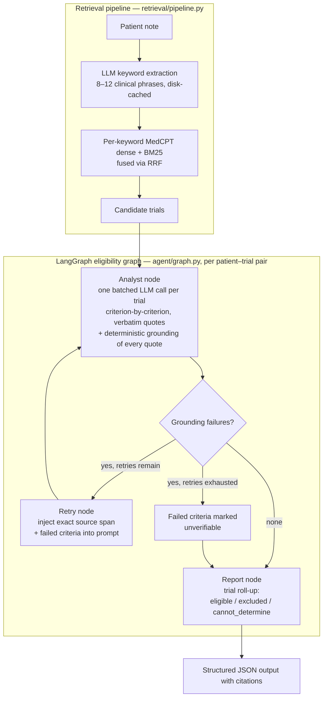

# TrialGuard

**Self-verifying, multi-agent clinical-trial eligibility intelligence.**

> *Faithfulness is the product.* Every eligibility verdict is backed by a verified citation from the source trial, or explicitly flagged as unverifiable.

Live demos:

- **Stage A web app** (live `ctgov_live` corpus, quote-in-source UI):
  [web-five-virid-38.vercel.app](https://web-five-virid-38.vercel.app) (frontend) —
  API at [trialguard-api.fly.dev](https://trialguard-api.fly.dev/api/health).
  Deploy guide [`docs/deploy_stage_a.md`](docs/deploy_stage_a.md).
- **Gradio** ($0 SIGIR `FileIndex` on HF Spaces): `app.py` — see [`docs/deploy.md`](docs/deploy.md).

---

## Problem

Matching patients to clinical trials is a validated, largely unsolved bottleneck. The NIH's 2024 TrialGPT work (*Nature Communications*) and Mass General Brigham's RECTIFIER trial showed LLM-assisted screening can roughly double enrolment rates and cut screening time ~40%. The dangerous failure mode: an AI that confidently declares a patient *eligible* based on a hallucinated or misread criterion — a patient-safety issue, not a UX annoyance.

## Thesis

Analyst drafts a criterion-by-criterion assessment with quoted evidence; a **deterministic verifier** then checks every quote is verbatim in the source. A verdict survives only if its citation is real, else it retries (≤2) or is downgraded to *unverifiable* — never forced. Grounding is pure Python: it cannot hallucinate agreement and costs nothing, which is what makes faithfulness measurable rather than asserted.

---

## Architecture

Two stages. Retrieval is a standalone pipeline (`retrieval/pipeline.py`), not a
graph node; the LangGraph graph (`agent/graph.py`) runs once per (patient, trial)
pair on the retrieved candidates.


```mermaid
flowchart TD
    subgraph RP [Retrieval pipeline — retrieval/pipeline.py]
        A[Patient note] --> B[LLM keyword extraction\n8–12 clinical phrases, disk-cached]
        B --> C[Per-keyword MedCPT dense + BM25\nfused via RRF]
        C --> D[Candidate trials]
    end
    subgraph EG [LangGraph eligibility graph — agent/graph.py, per patient–trial pair]
        D --> E[Analyst node\none batched LLM call per trial\ncriterion-by-criterion, verbatim quotes\n+ deterministic grounding of every quote]
        E --> F{Grounding failures?}
        F -- none --> G[Report node\ntrial roll-up:\neligible / excluded / cannot_determine]
        F -- yes, retries remain --> H[Retry node\ninject exact source span\n+ failed criteria into prompt]
        H --> E
        F -- "yes, retries exhausted" --> I[Failed criteria marked\nunverifiable]
        I --> G
    end
    G --> J[Structured JSON output with citations]
```

Graph nodes are `analyst`, `retry`, `report`. Deterministic grounding
(`verify/grounding.py`) runs inside the analyst node — every quote is checked
verbatim against the trial text and patient note — and the conditional edge
routes on its failures. Criteria are typed: inclusion `not_met` or exclusion
`met` excludes the trial; eligible only if every inclusion is `met` and every
exclusion is `not_met`. Prompt v4 labels each criterion with its kind. A Gradio
UI sits in front of this; retrieval is `FileIndex` (SIGIR) or the live
`ctgov_live` corpus, selected by `TG_DEMO_SOURCE`. On the production corpus the
per-keyword searches run concurrently, dense against an in-memory matrix and
lexical against Postgres FTS, falling back to pgvector until the matrix is
resident.

### Component map

| Component | Technology | Cost |
|---|---|---|
| Orchestration | LangGraph | free |
| LLM inference | DeepInfra (Llama 3.3 70B, FP8) — Groq free tier still runnable | **paid (~$0.10/$0.32 per 1M)** |
| Embeddings | MedCPT (768-dim, NCBI) on CPU/MPS | free (local) |
| Lexical retrieval | Postgres FTS (production); BM25 `rank-bm25` (eval); RRF fusion | free |
| Vector store | in-memory numpy matrix for dense search, pgvector on Neon as the store of record (production); numpy file index (eval/demo) | **paid (Neon)** |
| Verification | deterministic quote grounding (pure Python) | free |
| Tracing | Langfuse free tier | free tier |
| Demo hosting | Gradio on HF Spaces ($0 SIGIR); FastAPI + Next.js Stage A (live corpus) | free / small metered |

Two paid lines, both small. The production vector store: the 26k-trial oncology
corpus (531 MB) exceeds Neon's 512 MB free ceiling. And inference: the free tier's
100k-tokens/day cap, not its price, was what stalled two Phase 4 measurements for
weeks, so Phase 8 moved the analyst to a metered host. **Every eval run in this
repo — four A/Bs, 584 calls — cost $0.11 in total.** The demo still runs at $0 on
a free HF Spaces CPU.

---

## Data Sources

- **ClinicalTrials.gov API v2** — 500k+ studies, public domain, no auth, JSON
- **SIGIR 2016 patient–trial matching cohort** — 183 synthetic patients, published labels
- **TREC Clinical Trials 2021/2022** — 75k+ eligibility annotations (gold eval standard)

Scope locked to **oncology** trials (richest trial volume, best eval overlap).

All patient profiles in demos are **synthetic**. No real patient data enters this system.

---

## Measured results

Full reports: [`data/reports/phase2_3_results.md`](data/reports/phase2_3_results.md) (Phase 2/3), [`data/reports/phase4_agent.md`](data/reports/phase4_agent.md) (Phase 4), [`phase8_provider_parity.md`](data/reports/phase8_provider_parity.md) and [`phase8_carryover.md`](data/reports/phase8_carryover.md) (Phase 8), [`phase9v4_agent_trec_2021.json`](data/reports/phase9v4_agent_trec_2021.json) (Phase 9 v4 TREC). All numbers reproduced from code; the full Phase 8 measurement set reruns for ~$0.10.

**Phase 4 (complete, finished in Phase 8):** the faithfulness A/B p-value is computed in-harness (`eval/significance.py`) instead of by hand; abstention vs citation-precision is reported as a swept curve, not a single point (`min_tokens=2` sits at the knee, and abstention is analyst-driven, not a grounding artifact); the retry is retrieval-aware (hands the analyst the exact source span for failed criteria); and the analyst prompt is additively versioned. The v2 and TREC retry A/Bs were quota-blocked for weeks behind the Groq daily cap and ran once inference moved to a metered host — see the two findings below.

**Retrieval — MedCPT vs BGE (SIGIR, keyword-RRF, n=53):** recall@10 0.135 → **0.180 (+34%)**, MRR 0.284 → **0.345 (+21%)**. MedCPT adopted as default.

**Retrieval — full-corpus honest test (MedCPT, ~26k trials, ~100% gold coverage):**

| Cohort | n | recall@50 | recall@100 | MRR |
|---|---|---|---|---|
| TREC 2021 | 75 | **0.296** | **0.440** | **0.658** |
| TREC 2022 | 50 | 0.313 | 0.464 | 0.667 |

**Retrieval — keyword-importance decay (adopted 2026-09-04).** The extraction prompt ranks keywords most-to-least important and fusion discarded that ordering, counting all 24 lists equally. Weighting each keyword's lists by `1/i` — the aggregation TrialGPT publishes — is significant on both cohorts of record at the depths that matter: recall@100 +5.1% (p=0.0386) and recall@200 +6.1% (p=0.0014) on TREC 2021, +6.0% (p=0.0025) and +4.3% (p=0.0063) on TREC 2022. MRR rises with recall (0.626 → 0.658), so depth is not bought with head quality. R3 had tested the same lever at recall@50, where the effect is weakest and where its null reproduces exactly (p=0.2301); H1 is what moved the metric that matters to recall@100–200. Report: [`keyword_decay_findings.md`](data/reports/keyword_decay_findings.md).

**End-to-end — the number the thesis actually claims.** Retrieval recall and faithfulness each describe one stage; neither says whether a patient note in yields eligible trials out. Composed end to end (note → keywords → retrieval → agent → tiered roll-up), the system surfaces eligible trials at:

| Cohort | n | assessed pool | retrieval ceiling | **surfaced recall** | precision | pool base rate | lift |
|---|---|---|---|---|---|---|---|
| TREC 2021 | 20 | top-10 | 0.048 | 0.0276 | 0.689 | 0.429 | 1.60x |
| TREC 2021 | 20 | top-100 | 0.298 | **0.1770** | 0.555 | 0.345 | 1.61x |
| TREC 2022 | 20 | top-10 | 0.067 | 0.0430 | 0.698 | 0.547 | 1.28x |
| TREC 2022 | 20 | top-100 | 0.378 | **0.2580** | 0.533 | 0.369 | 1.45x |

**The assessed-pool size, not the embedding model, was the binding constraint.** A depth diagnostic showed gold trials are not missing from the candidate space — they are present and misordered (recall 0.766@500 on 2021, 0.788@500 on 2022, under 6% never ranked; median gold rank 130–180). Widening the pool handed to the agent from 10 to 100 lifts surfaced recall **6.4x / 6.0x** with no change to retrieval, prompt or verifier, and the agent's lift over its pool's own base rate stays flat-to-rising through the full 10x dilution — it filters at a constant rate rather than borrowing its precision from a rich pool. Reports: [`h1_pool_curve_trec2021.md`](data/reports/h1_pool_curve_trec2021.md), [`h1_pool_curve_trec2022.md`](data/reports/h1_pool_curve_trec2022.md). Quote the lift, not the raw precision: TREC's retrieved pool is already 34–55% gold-eligible. Deep pools are a serving-cost question (~$0.05 and ~10 min/patient at top-100), so the demo makes depth an explicit opt-in: search returns 5 candidates by default, or up to 25 with **Deep search** checked, and the UI quotes the measured cost and wait before you commit to it.

**Faithfulness — verifier mechanism:** deterministic catch-rate stress test — **51/51 corrupted quotes rejected, 0 false rejections** (14 genuine quotes; artifact: [`data/reports/verifier_stress.json`](data/reports/verifier_stress.json)). Sample-size-independent.

**Faithfulness — verified vs single-pass A/B (matched paired):**

*Generic retry (Phase 3, "copy verbatim" nudge):*

| Cohort | matched n | single-pass | verified | Fisher p | |
|---|---|---|---|---|---|
| SIGIR | 179 | 9.26% | 3.38% | **0.0012** | ✅ significant (−64%) |
| TREC 2021 | 59 | 12.0% | 11.26% | 0.86 | ❌ null (−6%) |
| TREC 2022 | 60 | 12.3% | 9.40% | 0.54 | ❌ ns (−24%, underpowered) |

*Retrieval-aware retry (Phase 4 mechanism, measured in Phase 8 — injects the exact source span plus the failed criteria):*

| Cohort | matched n | single-pass | verified | Fisher p | |
|---|---|---|---|---|---|
| SIGIR | 177 | 9.30% | 2.92% | **0.0004** | ✅ significant (−68.6%) |
| TREC 2021 | 59 | 13.33% | 3.97% | **0.0103** | ✅ significant (−70.2%) |
| TREC 2022 | 60 | 14.84% | 4.95% | **0.0168** | ✅ significant (−66.7%) |

**Both TREC cohorts now reach significance.** The Phase 4 hypothesis was that the generic nudge only recovered *paraphrase* failures — which is why it worked on SIGIR and not TREC — while TREC's failures were verbatim misses needing the characters to copy from. Handing the analyst the source span confirms it.

> **Caveat, stated rather than buried:** the second table changed retry logic *and* inference provider together, so it is not a controlled experiment. The arms decompose the confound — baseline arms run no retry at all and barely moved (TREC 2021 12.0% → 13.3%, TREC 2022 12.3% → 14.8%), while verified arms diverged sharply. Had the host driven the improvement, the baselines would have moved too. The clean control (Phase 3 retry on the new host) is unrun and recorded as outstanding in [`phase8_carryover.md`](data/reports/phase8_carryover.md).

**The faithfulness floor holds regardless of cohort or host**: deterministic grounding catches 100% of ungrounded verdicts and forces them to *unverifiable* (51/51 corrupted-quote catch rate); a hallucinated citation never passes as grounded. What was cohort-dependent is whether a caught failure gets *fixed* by retry or converted to an honest *abstention*. Replication also surfaced and fixed a grounding bug (short clinical facts like "48 M", "EF was 25%" were rejected by a char-length guard, now a token guard).

> **What the citation does not prove, with a number (Phase 10 WS-5b).** Grounding settles *existence*, not *entailment*: a quote can be genuinely verbatim and still not establish the verdict it supports. On a seeded random sample of **50 grounded decisive verdicts** (25 per cohort, adjudicated on one question — does this quote establish this verdict, not is the verdict correct), **36% did not** (95% CI 24–50%; SIGIR 48%, TREC 2021 24%). The recurring shapes are evidence pointing the other way, one conjunct of a compound criterion, and an adjacent fact standing in for the required one. This is not a 36% error rate — the quote is real in every case and many of the verdicts are still right — it is the size of the gap between *cited* and *shown*. The machine-checkable subset of it (a quote that only restates its own criterion) is 0.12–0.37% and is recorded as `self_referential`. [AD-3](#architectural-decision-log) rules out an LLM verifier on correlated-error grounds, so this stays open rather than fixed. Items, per-item reasons and caveats: [`ws5b_entailment_sample.json`](data/reports/ws5b_entailment_sample.json), [`ws5_guardrails_findings.md`](data/reports/ws5_guardrails_findings.md).

> **The patient note is a grounding source, and that cannot be removed (Phase 10 WS-5a).** Restricting decisive verdicts to quotes found in the *trial's* text was measured on both cohorts and rejected: **84% of grounded quotes exist only in the patient note** (SIGIR 458/545, TREC 673/818), because the evidence that a patient satisfies a criterion lives in the patient record while the trial states only the requirement. Enforcing it raised the criterion unverifiable rate from 3.1% to 42.6% (SIGIR) and 3.5% to 50.0% (TREC) and emptied the `eligible` tier entirely. So the honest statement of the contract is: *a quote is verified to appear verbatim in the inputs, and for patient facts the input is the user's note.* A user who states false facts gets verdicts faithful to those false facts — garbage-in, not hallucination, and indistinguishable to any verifier reading the same note. What ships is visibility: `grounded_in` per assessment, `note_only_grounded` per request, and the flag kept behind `TG_GROUND_TRIAL_ONLY` (default off) so the measurement is reproducible.

**Prompt v2 — lowering abstention did not cost faithfulness** (SIGIR, same host, 180 trials, verified arm):

| | v1 | v2 |
|---|---|---|
| citation precision | 0.9713 | **0.9896** |
| abstention | 0.7047 | **0.6543** |
| coverage | 0.2953 | **0.3457** |
| trial accuracy | 0.2611 | **0.3778** |

The open question was whether abstaining less would mean committing to shakier verdicts. It did not — abstention fell 5.0pp while citation precision *rose*, which suggests v1's abstention was largely the analyst declining to look for evidence it could have found. Retry stays significant on top of v2 (p=0.0006), so the prompt and the verifier address different failure modes.

**Exclusion criteria (prompt v4).** Prior prompts scored inclusion only, so a
correct exclude was structurally impossible. v4 types each criterion and the
roll-up inverts exclusion semantics. SIGIR cannot measure that change: the
corpus has no `exclusion criteria:` header, so `by_kind.exclusion.n_criteria`
is 0 on [`phase9v4_agent_sigir.json`](data/reports/phase9v4_agent_sigir.json).
That rerun measures the `MAX_CRITERIA` 12→24 lift, not exclusion handling
(verified trial accuracy 0.2611 → 0.3722; unsupported-verdict rate 0.0287 →
0.0966; retry still significant, −34.7%, p=0.0132).

> **Update 2026-08-31.** The missing header was worse than "SIGIR cannot measure
> exclusions". SIGIR strips the words `exclusion criteria` and leaves a bare `:`
> (2,666 of 2,991 trials), so all 36,826 criteria were filed as *inclusions* and a
> correct "patient does not have <disqualifier>" verdict read as a failed
> requirement — silently excluding trials the patient was eligible for. Fixed in
> `c8d9779`; SIGIR now parses 17,090 inclusion + 19,736 exclusion, sum conserved.
> **The trial-accuracy figures in this paragraph predate that fix and are not
> reproducible against current code.** Faithfulness figures are unaffected —
> grounding checks quotes against source text and never consults criterion kind.
> TREC 2021 remains the cohort of record ([`e1b_findings.md`](data/reports/e1b_findings.md)).

TREC 2021 is the cohort that contains exclusion text
([`phase9v4_agent_trec_2021.json`](data/reports/phase9v4_agent_trec_2021.json),
30 patients, 180 trials, $0.083). Verified arm, split by kind:

| Kind | Criteria | Unsupported rate | Citation precision |
|---|---|---|---|
| Inclusion | 1305 | 9.2% | 0.908 |
| Exclusion | 691 | **31.2%** | 0.688 |

Retry vs single-pass on that mix is not significant (−10%, Fisher p=0.2514).
About 71% of remaining unsupported decisive verdicts are exclusion. Inclusion
on TREC (9.2%) matches SIGIR v4 inclusion (9.7%); the aggregate drop is
exclusion quoting, not a harder inclusion task.

**Diagnosed and fixed in v5** ([`phase9v5_exclusion_grounding.md`](data/reports/phase9v5_exclusion_grounding.md)).
Every exclusion failure in a sampled trace was one pattern, and none were
hallucinations: an exclusion criterion answered `not_met` asserts the patient does
*not* match a disqualifier, which is a claim about **absence of evidence** that no
verbatim span can support. The analyst could only return an empty quote or write a
negation like "No mention of hepatocellular carcinoma", and the verbatim check
scored correct reasoning as unfaithful. Verbatim grounding is well defined for
presence claims and undefined for absence claims.

Absence is now verified mechanically rather than exempted (exempting it would be a
hallucination loophole): the criterion's distinctive terms must be genuinely
absent from the patient note. If a term is present a quotable span exists and the
verbatim requirement still applies, so a fabricated negation cannot pass. Same
cohort, 180 trials, verified arm:

| Kind | Criteria | Unsupported v4 → v5 | Precision v4 → v5 |
|---|---|---|---|
| Inclusion | 1294 | 9.2% → 8.0% | 0.908 → 0.920 |
| Exclusion | 696 | **31.2% → 8.9%** | 0.688 → **0.911** |

Exclusion now matches inclusion instead of trailing it threefold, and **retry
significance is restored on TREC 2021**: −10.1% (p=0.2514, ns) → **−31.9%
(p=0.0048)**, matched n=176. Trial accuracy 0.433 → 0.450, now above the baseline
arm (0.444) rather than below it. Both arms improve because the change is to the
verifier, which runs in the baseline arm too; significance returns because the
retry now has groundable failures to work on instead of structurally unfixable
ones. v5 is a fresh run (the v4 analyst cache was lost with the EC2 instance), so
inclusion's +1.2pp with no logic change affecting it marks the run-to-run noise
floor — the exclusion move is an order of magnitude outside it.

SIGIR is unaffected by construction: it yields zero exclusion criteria, so the
absence path never fires and every committed inclusion-only result is untouched.
The CI gate stays anchored to Phase 8 SIGIR
(`verified.unsupported_verdict_rate` 0.0287, threshold 0.05); the TREC reports
(v4 0.184, v5 0.084) are not a new baseline.

**Provider parity.** Inference moved to an FP8-quantized build, which changes numerical precision on the model that produces verbatim quotes — a failure that would be *silent*, since a paraphrased quote just fails grounding and downgrades to *unverifiable*, a legitimate output. Measured rather than assumed: on a matched 180-trial baseline arm, citation precision was unchanged (0.9057 → 0.9086). [`phase8_provider_parity.md`](data/reports/phase8_provider_parity.md)

> **Note on `criterion-matching accuracy ≥ 87%`:** retired as a target (2026-08-31). It was never measurable here — every label in SIGIR and both TREC cohorts is trial-level (`qrels`: 0=irrelevant, 1=excluded, 2=eligible), and no criterion-level gold exists. Trial-level roll-up had been standing in for it, which answers a different question. The claim in its place is **faithfulness** (2.76% unverifiable on SIGIR, 3.95% on TREC 2021; verifier catch rate 100%) plus the **tiered contract** — trials separate into `eligible` / `needs_review` / `excluded`, where `needs_review` means no disqualifier and N unstated facts. Worth **1.60x lift over base rate on TREC, 1.39x on SIGIR** ([`e1b_findings.md`](data/reports/e1b_findings.md)); quote the lift, not raw precision, because TREC's retrieved pool is already 42.9% gold-eligible.

> **Note on `recall@10 ≥ 90%`:** retired as a target. It is mathematically capped at `min(10, |gold|)/|gold|` per patient — TREC patients average 60+ eligible trials (ceiling ~0.25). TrialGPT's ">90% recall" was measured at large depth. Primary retrieval metric is now **recall@pool** (recall@50/100).

### Serving latency (Stage A, live `ctgov_live`)

Measured end to end against the deployed API, same synthetic note and same 12
extracted keywords throughout, so each figure is comparable to the one above it.

| Change | Search (warm) |
|---|---|
| Starting point | 24,382 ms |
| API moved to `syd`, beside Neon (`ap-southeast-2`) | 3,800 ms |
| Per-keyword searches fanned out concurrently | 2,796 ms |
| Dense retrieval served from an in-memory matrix | **780 ms** |

**31× overall**, and the rankings are byte-identical at every step — verified by
re-running the same query across each switch, because a speedup that changes
which trials a patient is shown is a regression wearing a win's clothing.

Four causes, each measured rather than guessed, and none of them the first
suspect:

- **Geography, not query cost.** The app ran in `iad` while Neon sat in Sydney.
  One search issues 60 round trips — 12 keywords × (dense + lexical), each with
  its `SET LOCAL`, `SELECT` and `COMMIT` — so ~250 ms of distance was ~15 s of
  the 24 s. Isolated by timing `/api/health` (one `SELECT 1`) against
  `/api/budget` (no database): the gap was 940 ms, and is now ~0.
- **Serialisation.** The per-keyword loop waited on each round trip in turn.
  Worth 2.26× locally but only 1.49× deployed: once the network was gone the
  queries were bound by Neon's CPU, not by latency, and past four concurrent
  workers contention cost more than overlap won.
- **The vector index was never used.** `EXPLAIN` shows a sequential scan: the
  planner declines ivfflat at `probes=40`, because probing 40 of 161 lists costs
  more than reading the table. pgvector was doing exact search all along, so
  moving that scan into an 80 MB in-process matrix computes the same answer
  60–85× faster per query (3.8–6.7 ms vs 320–413 ms) — identical ordering, scores
  agreeing to 2.8e-07.
- **Image weight at boot.** `sentence-transformers` pulls torch, whose default
  Linux wheel bundles ~2 GB of CUDA libraries that a GPU-less machine never
  executes but must still page in. Boot 114 s → 79 s; image 3.2 GB → 893 MB.
  Diagnosed by noticing boot was identical on shared and performance CPUs, which
  rules out compute.

Dense retrieval no longer touches Postgres, which keeps the lexical half where a
GIN index answers in 7 ms. The matrix loads on a background thread in ~33 s and
search falls back to pgvector until it is resident, so the fast path is an
optimisation rather than a dependency; `/api/health` reports which one is
serving. It is a snapshot, so trials ingested after startup appear on the next
restart — right for a corpus refreshed on a schedule, wrong for live-updating
data. Past roughly a million rows the matrix stops fitting and a real ANN index
earns its keep.

---

## Metric targets

| Metric | Target | Status |
|---|---|---|
| Retrieval recall@pool (50/100) | maximize; beat BGE baseline | ✅ MedCPT adopted (+34% recall@10) |
| Verifier catch rate | 100% (deterministic) | ✅ 51/51 ([`verifier_stress.json`](data/reports/verifier_stress.json)) |
| Hallucination rate | < single-pass baseline (measured) | ✅ all three cohorts: SIGIR −68.6% (p=0.0004), TREC 2021 −70.2% (p=0.0103), TREC 2022 −66.7% (p=0.0168) |
| Correct-refusal rate ("cannot determine") | Logged per run | ✅ abstention reported jointly with accuracy |

---

## Development Phases

| Phase | Status | Artifact |
|---|---|---|
| 0 — Foundations | ✅ Done | Repo + README + env skeleton |
| 1 — Data ingestion | ✅ Done | Queryable corpus + parsed eval cohorts |
| 2 — Retrieval | ✅ Done | MedCPT hybrid retriever (recall/latency report) |
| 3 — Eval harness + agent | ✅ Done | Self-verifying graph + significant faithfulness A/B (−64%, p=0.0012) |
| 4 — Agent tuning | ✅ Done | v2 prompt cuts abstention at higher coverage *and* precision; retrieval-aware retry reaches significance on all three cohorts; in-harness significance + coverage/faithfulness curve. Final A/Bs completed in Phase 8 |
| 5 — LLMOps & hardening | ✅ Done | CI regression gate (100% verifier catch rate + committed faithfulness floors + frozen-prompt hash, all offline/$0); Langfuse run-level quality scores + dashboard spec; Groq daily token-budget with graceful cached-only degradation; OWASP LLM hardening (out-of-band injection defense proven, output-schema validation, synthetic-data guard); prompt registry. pgvector-vs-managed benchmark compute-paced |
| 6 — Demo & docs | ✅ Done | Gradio demo (`app.py`) + cost-engineering write-up + deploy guide; HF Spaces deploy + recorded walkthrough user-gated |
| 7 — Production corpus | ✅ Done | 25,965 recruiting oncology trials in pgvector; lexical BM25 → Postgres FTS (tsvector + GIN, indexes exclusion too); hybrid stack validated vs gold (recall@100 non-regressing, recall@10 +0.043); ivfflat probes retuned 20→40; resumable ingest + safe corpus refresh. Report: [`data/reports/phase7_retrieval.md`](data/reports/phase7_retrieval.md) |
| 8 — Provider migration & cost ops | ✅ Done | Provider-agnostic LLM layer; analyst cache keyed by (provider, model) with a legacy carve-out so committed Phase 3/4 entries are never orphaned; USD cost ledger with a daily circuit breaker, billed from the provider's reported cost; FP8 parity gate before adopting the new host; the two quota-blocked Phase 4 A/Bs completed for $0.10. Reports: [`phase8_provider_parity.md`](data/reports/phase8_provider_parity.md), [`phase8_carryover.md`](data/reports/phase8_carryover.md) |
| 9 — Close the production loop | ✅ Done (Stage A) | Typed inclusion+exclusion (prompt v4) and inverted trial roll-up; Gradio hits `ctgov_live` behind `TG_DEMO_SOURCE` (SIGIR `FileIndex` remains the $0 default); FastAPI Stage A (`src/trialguard/api/`) + Next.js (`web/`) wrap `retrieve()` / `assess()` unchanged with search/assess split, SSE, and quote-in-source highlighting. TREC 2021 v4 exclusion caveat (unsupported 31.2% vs 9.2% inclusion, retry ns at p=0.2514) resolved by absence grounding: exclusion 8.9%, retry significant at p=0.0048 ([`phase9v5_exclusion_grounding.md`](data/reports/phase9v5_exclusion_grounding.md)). Deploy: [`docs/deploy_stage_a.md`](docs/deploy_stage_a.md); retrieval latency 24.4 s → 780 ms end to end (region, concurrency, in-memory dense index) with rankings unchanged; spend ledger and keyword cache moved to Postgres; served path traced to Langfuse |
| 10 — Reliability | ✅ Done | Jobs and their events in Postgres with `Last-Event-ID` SSE resume, so a killed machine loses no completed work and a disowned worker stops spending ([AD-13](#architectural-decision-log) and its two amendments); corpus refresh on a Fly scheduled machine recreated by `scripts/deploy_api.sh` on every deploy, diffing on `lastUpdatePostDate` so revised eligibility text is re-embedded rather than served stale; a live-endpoint probe (`eval/served_probe.py`) because a trace-reading monitor is blind exactly when the API is down, plus the monitor armed to fail rather than skip on a missing secret; a 240 s per-trial deadline — the real bound was ~27 min, since `TG_LLM_TIMEOUT` is per HTTP attempt and both the provider client and the graph retry; latency SLO enforced post-deploy, which is how the **20,576 ms first search after a resume from suspend** was found ("780 ms warm" is the steady state, not what a user meets); per-request faithfulness on the `done` event and the trace; a 13-case failure-injection suite. Two guardrail experiments returned negatives and are recorded as such: trial-only grounding ([AD-14](#architectural-decision-log)) and prompt v5 ([AD-16](#architectural-decision-log)). Reports: [`ws5_guardrails_findings.md`](data/reports/ws5_guardrails_findings.md), [`l1_findings.md`](data/reports/l1_findings.md) |

---

## Quickstart

```bash
git clone https://github.com/YOUR_USERNAME/TrialGuard
cd TrialGuard

python -m venv .venv && source .venv/bin/activate
pip install -e ".[dev]"

cp .env.example .env
# Fill in .env values (see .env.example for required keys)

pytest tests/
```

Run the evals:

```bash
# Retrieval sweep (MedCPT default; keyword-RRF)
python -m trialguard.scripts.eval_retrieval --cohort sigir --use-keywords

# Agent faithfulness: single-pass vs verified A/B (writes phase4_agent_<cohort>.json:
# in-harness Fisher significance + coverage/faithfulness curve)
python -m trialguard.eval.agent_metrics --cohort sigir --n-patients 30 --per-class 3

# v2 analyst prompt (targets over-abstention; additive, own cache namespace)
TG_PROMPT_VERSION=v2 python -m trialguard.eval.agent_metrics --cohort sigir --tag phase4v2

# v4: inclusion + exclusion (additive cache namespace; app.py defaults to v4)
TG_PROMPT_VERSION=v4 python -m trialguard.eval.agent_metrics --cohort sigir --tag phase9v4
```

> Inference defaults to DeepInfra (metered). Every analyst call is cached by `(prompt_version, provider, model, patient, trial)`, so a rerun costs nothing and an interrupted run resumes rather than repeats — a killed parity run replayed 92 calls for free. A daily USD cap (`llm/cost.py`) refuses calls past the ceiling instead of overspending, and a per-day history keeps the cost story auditable. Set `LLM_PROVIDER=groq` to reproduce Phase 3/4 from the committed Groq cache; the free tier's ~12k tokens/min and 100k tokens/day still apply on that arm, and `TG_ANALYST_DELAY` paces calls under the TPM window.

### Run the demo locally

```bash
pip install -e ".[demo]"
python app.py    # Gradio UI on http://localhost:7860
```

Pick a synthetic patient or paste a synthetic note; the app retrieves candidate
oncology trials and shows each criterion's verdict with its **verbatim citation**
and a grounded / *unverifiable* badge — the faithfulness thesis made visible.
Default retrieval is the self-contained SIGIR `FileIndex` (no database). Set
`TG_DEMO_SOURCE=ctgov_live` to hit the production corpus (needs `DATABASE_URL`).
Deploy to HF Spaces: [`docs/deploy.md`](docs/deploy.md).

### Run Stage A (FastAPI + Next.js)

```bash
pip install -e ".[web]"
export API_CORS_ORIGIN=http://localhost:3000
python -m trialguard.api          # http://localhost:8000

cd web && cp .env.example .env.local && npm install && npm run dev
# → http://localhost:3000
```

Search and assess are separate: ranked `ctgov_live` hits first, then user-chosen
NCT IDs stream over SSE. Trial detail highlights assessed quotes inside
`eligibility_raw` only when they appear verbatim. Deploy:
[`docs/deploy_stage_a.md`](docs/deploy_stage_a.md).

---

## Stack & cost

The stack leans on free tiers and local compute; two components are paid, both
small. Caching-first everything and a deterministic verifier (not a paid LLM judge)
keep the footprint to a small database and cents of inference.

The interesting cost lesson is that the binding constraint was never price. The
free tier's 100k-tokens/day ceiling blocked two Phase 4 measurements for weeks;
at metered rates the same work cost **$0.0958**. Free is not the same as cheap
when the limit is throughput.

- **Inference:** DeepInfra (Llama 3.3 70B, FP8) at ~$0.10/$0.32 per 1M tokens,
  adopted only after a parity gate confirmed quantization did not degrade verbatim
  quoting. A daily USD cap (`llm/cost.py`) refuses calls past the ceiling rather
  than overspending, billed from the provider's own reported cost instead of a
  local price table that can go stale. Every analyst call is cached by
  `(prompt_version, provider, model, patient, trial)` — the provider is part of
  the key because two hosts must never share an entry. The Groq free-tier arm
  stays runnable and reproduces Phase 3/4 from cache at $0.
- **Embeddings:** MedCPT (110M) on CPU/MPS — a one-time offline job, cached to `.npy`.
- **Verification:** deterministic quote grounding is pure Python. The faithfulness
  guarantee costs nothing and cannot be rate-limited.
- **Vector store:** pgvector on a paid Neon instance is the store of record for
  production (the 26k-trial corpus is 531 MB, over the 512 MB free ceiling), and
  serves the lexical half via Postgres FTS. Dense search runs against an 80 MB
  in-process matrix, because at 26k rows the planner declines the ivfflat index
  and scans the table anyway — so the same exact search is 60–85× faster done
  locally. Eval and the demo use numpy `FileIndex` and stay free. The size
  ceiling — not query speed — is why the corpora were split in the first place
  ([`phase5_vectorstore.md`](data/reports/phase5_vectorstore.md)).
- **CI:** the regression gate runs on committed artifacts only, so it makes no LLM
  calls and stays free on GitHub Actions.
- **Serving:** Gradio on a free HF Spaces CPU (SIGIR `FileIndex`, $0); Stage A
  FastAPI + Next.js for the live `ctgov_live` corpus (quote-in-source UI), with
  per-request / per-IP / daily USD caps. MedCPT runs on the API host, baked into
  the image so a cold boot does not download it. The API is pinned to `syd`
  beside Neon — the same machine in `iad` spent ~15 s per search on nothing but
  distance — and suspends when idle, snapshotting RAM so a resume skips the model
  load entirely. The daily spend ledger lives in Postgres and accumulates through
  an atomic upsert: as a JSON file behind a per-instance lock it lost 88% of
  concurrent spend, and reset on every deploy.

---

## Key References

- Jin et al., *Matching patients to clinical trials with large language models* (TrialGPT), *Nature Communications*, 2024
- NIH/NLM TrialGPT dataset release — SIGIR 2016, TREC CT 2021/2022
- Mass General Brigham RECTIFIER randomised trial
- ClinicalTrials.gov API v2 documentation (NLM Technical Bulletin, 2024)

---

## Architectural Decision Log

| AD | Decision | Alternatives considered |
|---|---|---|
| AD-1 | LangGraph orchestration | LCEL chain, LlamaIndex, bespoke Python |
| AD-2 | Hybrid retrieval (dense + BM25) + RRF | Dense-only, keyword-only |
| AD-3 | Analyst → **deterministic grounding** with back-edge | LLM re-read verifier (correlated errors), self-consistency voting |
| AD-4 | Criterion-level structured JSON output | Free-text verdict, binary flag |
| AD-5 | MedCPT (768-dim) embeddings on CPU/MPS | MiniLM (0.49 recall ceiling), BGE (same ceiling), hosted API |
| AD-6 | pgvector (production) + numpy file index (eval) | Load 26k eval trials into Neon free tier (too small) |
| AD-6 (amended, Phase 5) | Benchmark ([`phase5_vectorstore.md`](data/reports/phase5_vectorstore.md)) confirms the split: numpy brute is exact and sub-ms at eval scale, and the free-tier 512 MB ceiling (full corpus ≈ 1.5 GB of vectors) is the real driver. Amendment: production ivfflat at default `probes=1` loses ~64% recall vs exact; `dense_search` now sets `ivfflat.probes` (default 20) to recover it at near-flat latency | Silent default-probes recall loss; managed alternative (size ceiling, not engine, is binding) |
| AD-6 (amended, Phase 7) | Neon upgraded off the free tier; production `ctgov_live` populated with 25,965 recruiting oncology trials (531 MB, over the 512 MB free ceiling). Lexical moved from in-memory BM25 to Postgres FTS (tsvector + GIN) to serve at corpus scale; `probes` retuned to 40 (20 recovered only ~62% of exact). See [`phase7_retrieval.md`](data/reports/phase7_retrieval.md) | Staying on the free tier (corpus no longer fits); keeping in-memory BM25 (rebuilt per process, doesn't scale) |
| AD-7 | Groq free-tier hosted open model | Local quantised LLM, paid frontier API |
| AD-7 (amended, Phase 8) | Metered host (DeepInfra) for the same open model. The free tier's throughput ceiling, not its price, blocked two Phase 4 measurements for weeks; the whole outstanding set then cost $0.0958. The host serves only an FP8 build, so a parity gate ran *before* adoption — quantization changes numerical precision on the model producing verbatim quotes, and that failure is silent (a paraphrased quote just becomes an honest *unverifiable*). Citation precision was unchanged on a matched baseline arm. See [`phase8_provider_parity.md`](data/reports/phase8_provider_parity.md) | Staying free (throughput-blocked); a paid frontier API (breaks comparability with every committed number); Together/Fireworks at full precision (~9x the price, held as the fallback had parity failed) |
| AD-8 | Langfuse tracing from day one | Add logging later, print statements |
| AD-9 | Kaggle/Colab for batch jobs only | Always-on GPU, local only |
| AD-9 (unexercised) | Notebook GPU never needed through Phase 3 — MedCPT (110M) embeds on local CPU/MPS, and the eval bottleneck was Groq token quota (disk cache), not GPU hours. `notebooks/` stays empty; revisit only if Phase 4/5 batch work exceeds local compute | — |
| AD-10 | Gradio on HF Spaces ($0 SIGIR); Stage A FastAPI + Next.js for live corpus | Streamlit, local-only |
| AD-11 | LLM keyword extraction before retrieval | Raw patient narrative as query (semantic mismatch, recall ceiling) |
| AD-6 (amended again, Phase 9) | pgvector stays the store of record, but dense search is served from an 80 MB in-process matrix. `EXPLAIN` showed the planner declining ivfflat at `probes=40` and scanning the table, so production had been running exact search at 320–413 ms per query; the same exact search takes 3.8–6.7 ms locally, with identical rankings. `eval/file_index.py` had always done this — the two paths differed by label, not by measurement | Keeping dense search in Postgres; tuning `probes` further, which the planner ignores |
| AD-12 | API pinned to `syd`, beside Neon in `ap-southeast-2` | Leaving it in `iad`, where 60 round trips per search cost ~15 s in distance alone |
| AD-13 | Orphaned assess jobs fail visibly and the user retries; nothing requeues itself. A job row carries the writing process's instance id alongside a heartbeat, and a reader treats `running` as dead when a *different* instance sees it **or** the heartbeat is older than the threshold. Two conditions rather than one, because `fly.toml` suspends idle machines: suspend snapshots RAM, so the process resumes intact with a heartbeat frozen for the whole suspension, and an age-only test would report a live job failed. Deploy, crash and OOM each produce a new instance, so those are caught. Recovery is the durable event log, not the analyst cache — a free-text note sets `skip_cache_write`, so nothing a non-preset job computed is cached anywhere, and a retry is cheap only because completed `trial` events survive in Postgres and the client re-sends just the NCT IDs it never received. The note is stored under the same one-hour retention the in-process store already applied, enforced as a delete rather than eviction-on-read | Requeue on startup (needs leader election or two instances duplicate the work, and spends money nobody asked for, against the opt-in cost posture Phase 9 built); TTL eviction only (the client polls a `running` row until it gives up and the operator sees a queue that never drains); heartbeat age alone (one column, but it cannot tell suspension from death); disabling suspend so age becomes sufficient (bills the machine around the clock, already reverted once for cost) |
| AD-13 (amended in WS-1) | The rule as first written was a disjunction — a different instance **or** a stale heartbeat. Building it showed that is wrong in both directions. Age alone still fails a *suspended* job, which is the case the two columns existed to protect: the request that resumes a machine is a blocking read that can run before the resumed heartbeat task gets the event loop back. Instance alone fails a *healthy* job as soon as `auto_start_machines` puts a second machine behind the hostname and a poll is load-balanced away from the owner. Both clauses are necessary, so the test is a conjunction. That leaves one case a conjunction cannot see — a task dying inside a process that keeps running, where the instance never differs — and a timer is the wrong instrument for it: `_run_assess_job` now gives every job a terminal status in a `finally`, which is a known fact rather than an inferred one and also covers `CancelledError`, which the existing `except Exception` never caught | The disjunction as originally signed off (fails live jobs on suspend and under horizontal scaling); instance-only (no multi-machine safety); heartbeat-only (no suspend safety) |
| AD-13 (residual closed, WS-1) | A machine can be suspended and then simply never routed to again, so its job is stalled whether or not the process still exists — "suspended but unreachable" and "gone" are the same thing to everyone waiting on it, and telling them apart is not worth attempting. Another reader failing that job is therefore correct. What must not happen is the original owner waking later and continuing to spend on a job the user was told failed and has probably retried. `heartbeat()` returns whether the job is still the caller's to run — the guard is on the `UPDATE`, so a terminal row is never touched again — and the beat cancels the trial tasks when it is not. The beat is the natural place for this: it is the one thing a running job already does on a timer | Querying the Fly machines API for the owner's state (an untestable platform dependency for an undecidable question); a dispute-then-confirm second read (assumes traffic resumes the owner, which it does not when the load balancer routes elsewhere) |
| AD-14 | The patient note stays a grounding source. Grounding's contract is that a quote appears verbatim **in the inputs**, and for the facts that decide eligibility the input is the user's note — the trial states the requirement, not whether this patient meets it. Measured on both cohorts: 84% of grounded quotes exist only in the note, and restricting decisive verdicts to trial text raised the criterion unverifiable rate from 3.1% to 42.6% (SIGIR) and 3.5% to 50.0% (TREC), emptying the `eligible` tier. It also keeps the wrong survivors — of the 8 trial-grounded quotes on SIGIR, 2 restate their own criterion and 6 quote a different one, so none is evidence about a patient. The planted-evidence risk is therefore restated rather than mitigated: a user who writes false facts receives verdicts faithful to those false facts, which is garbage-in and is indistinguishable to any verifier reading the same note. What ships is provenance — `grounded_in` per assessment, `note_only_grounded` per request — with `TG_GROUND_TRIAL_ONLY` kept, default off, so the measurement is reproducible | Trial-only grounding (measured, rejected above); a weaker note-sourced *class* that still counts toward decisive verdicts (same numbers, plus a distinction nothing acts on); refusing notes that look like trial text (the overlap is legitimate clinical language, so this refuses real patients) |
| AD-15 | The entailment gap is stated with a number rather than closed. A verbatim quote can fail to establish the verdict it supports, and on a seeded 50-item sample 36% did (95% CI 24–50%). AD-3 rules out an LLM verifier for enforcement on correlated-error grounds, and that reasoning is unchanged by having measured the gap — a judge drawn from the same model family fails on the same criteria the analyst fails on. Using one *once*, offline, to size the problem was considered and rejected in favour of adjudicating a sample by hand, because the number's whole purpose is to be trustworthy where the automated path is not. The machine-checkable subset (a quote restating its own criterion) is recorded as `self_referential` at 0.12–0.37% and is a floor, not an estimate | An NLI model as a second verifier (a real option, and the honest reason it is not here is that it is a model to integrate and evaluate, not a check to add — P2, same shelf as NER-based PHI); an LLM judge in CI (AD-3); leaving the limit as prose, which is what `grounding.py`'s docstring already did |
| AD-16 | Prompt v5 addresses criteria by index instead of echoing their text. Measured on both cohorts and **not adopted**, despite passing its own acceptance test. Grounded counts and verdict distribution are superior on both — the opposite of L4, whose tell was grounded falling while abstention rose — but three things the acceptance did not ask about go the wrong way: TREC surfaced recall falls 26%, the self-referential quote count rises 4x on SIGIR and 20x on TREC (widening the machine-visible slice of the entailment gap AD-15 puts at 36%), and the latency case that revived L1 held on one cohort of two (−32% SIGIR, +3% TREC, because on TREC v5 answers 7% more criteria per call). Output per criterion fell 22–26%, not the ~50% a 43.4% echo share implied. Kept behind `TG_PROMPT_VERSION=v5`, v1–v4 untouched. **The defect it exposed outranks it:** under v4 the analyst silently answers 13.0% fewer criteria than it is asked on TREC — not truncation, `max_tokens` is 4096 against a 1,732-token longest response — and an unanswered criterion produces no assessment, so it cannot fail grounding, cannot trigger the retry edge, and vanishes into `needs_review` while the roll-up still calls the trial eligible over what it did receive | Adopting v5 on the strength of its own acceptance criterion (passes, but buys a recall regression with a latency win that did not arrive); shipping the coverage fix inside the addressing change (confounds two effects — the clean follow-up is a v6 keeping v4's addressing plus only v5's "one object per criterion" instruction); clamping an out-of-range index instead of dropping it (files a verdict under a criterion nobody assessed, and the quote grounds against the trial's whole text either way, so nothing downstream could catch it) |
| AD-17 | The analyst cannot be instructed into answering every criterion. Under v4 it silently returns ~9-13% fewer assessment objects than it was handed on TREC, and v5 fixed that while also changing addressing, so the cause was unattributable. v6 is v4 plus exactly one rule — *return one object per criterion, every criterion* — generated from v4 in code so the single-variable claim is enforced rather than trusted. Over 1,071 paired criteria it moved coverage by −0.65 pp (z = −0.53): nothing, with the two screens disagreeing on the sign. Both v5 and v6 carry that instruction and only v5, which numbers the criteria, recovers coverage (0.9970 against v4's 0.9249). The gain is a property of numbering, not of being told — plausibly because a numbered list is checkable and a bulleted one is not. Kept behind `TG_PROMPT_VERSION=v6`. The remaining candidate is therefore not a prompt: re-ask for the criteria that came back missing, reusing the retry edge that already re-asks for named criteria after a grounding failure | Adopting v5 for its coverage (measured, rejected in AD-16 at 26% of TREC surfaced recall); running v6's full quality A/B (400 calls on a prompt that had already failed its own premise — the cheap mechanism screen is what made this $0.065 instead of $0.23); leaving the shortfall unmeasured on the grounds that the roll-up reports unresolved criteria honestly, which is true and does not stop it calling a trial eligible over a subset |
| AD-18 | The analyst skipping criteria is fixed on the retry edge, not in the prompt, and the fix is on by default. Under v4 it never answered 13.0% of TREC criteria; a criterion with no assessment cannot fail grounding, so it never reached the retry edge, and `rollup_trial` still called a trial `eligible` over the subset it did receive. v5's numbering fixed coverage at 26% of surfaced recall (AD-16) and v6's instruction alone did nothing (AD-17), so the prompt was ruled out by measurement. Re-asking for the missing criteria takes them 230 → 167 (13.1% → 9.5%), grounded 848 → 918, `eligible` precision 0.571 → 0.714 and end-to-end recall 0.0026 → 0.0033, while surfaced recall falls 12%. **That cost was itself an artifact** and is corrected in AD-22: with the parser fixed the retry improves surfaced recall instead of costing it, because the penalty was the retry re-asking about section headers. **The coverage figures here are also corrected ones** — the originals (229 → 71, 13.0% → 4.0%) were computed with a metric that subtracted answered from asked, which nets criteria the model answered without being asked against criteria it skipped, and so flattered the retry arm specifically; see AD-20 and `p1_correction.md`. Adopted despite that, because the recall removed was produced by not looking: v4's extra surfaced trials include ones called eligible over a list that was silently 13% short, which CLAUDE.md already calls unsound. SIGIR is the control — 12 criteria skipped there, and the fix moves surfaced recall not at all. `TG_RETRY_MISSING=0` reproduces pre-2026-09-10 retry numbers | Leaving it open with two prompt routes eliminated (ships a roll-up the repo's own docs call unsound); adopting v5 for the same coverage at twice the recall cost and a 20x rise in self-referential quotes; keeping the fix behind a default-off flag like L4's, which would have made the sound path the one nobody runs |
| AD-19 | A verbatim quote cannot establish absence, and where it pretends to, the badge says so rather than the verdict changing. An exclusion answered `not_met` claims the patient does **not** match a disqualifier; `is_absence_grounded` exists for exactly that claim but runs only as a fallback, so any verbatim quote pre-empts it. Measured across both cohorts: 48 of 107 quote-grounded exclusion `not_met` rows have an absence check that disagrees, 129 of 840 grounded criteria on TREC (15.4%). Making absence primary was the obvious fix and was measured first: about half that class are legitimate refutations it would have destroyed, such as *2+ aortic insufficiency* against *Severe aortic regurgitation*, *18-week sized uterus* against *Uterine size > 32 weeks*, and *no angiographically apparent flow-limiting coronary artery disease* against *Coronary artery disease*. Nothing deterministic separates a refutation from a contradiction: both quote the same subject and differ only by negation, severity, laterality or count. So the row is stamped `weak_absence`, counted per request and in the eval, and rendered in the UI as *quote verified, but it does not establish absence* instead of a clean grounded badge | Absence primary with quote fallback (measured, destroys the correct half); requiring both (stricter still); requiring the quote to share a distinctive term with the criterion (catches three of the clear failures and misses the one that prompted this, whose quote contains *lung*); changing the verdict to unverifiable (the verdict is often right, it is the citation that does not carry it) |
| AD-20 | `criterion_unanswered` is counted against the criteria list, not computed as asked minus answered. The subtraction is not the number of criteria the analyst skipped: the model also returns assessments naming criteria that were never asked, and each one cancels a genuinely skipped criterion out of the total. It went **negative** on SIGIR, which is impossible and is what exposed it, and it had already been used to state AD-18's headline — flattering the retry arm, because a retry produces more output and therefore more drift (unmatched entries nearly double on TREC when it is on). Corrected: the coverage fix is 13.1% → 9.5%, not 13.0% → 4.0%. `criterion_unmatched` is now reported beside it, because a count that can be cancelled by a second phenomenon should never have been one number | Leaving the subtraction and treating the negative as a display quirk (it was load-bearing in a merged claim); dropping unmatched entries so the subtraction becomes valid again (changes what the roll-up sees to make a metric tidy, and those entries are real model output worth counting); re-deriving from `n_criteria` alone, which is the same subtraction wearing a different name |
| AD-21 | The analyst's "missing criteria" were mostly not the analyst. Decomposed against the cached corpus, TREC's 18.9% shortfall is 8.4% entries that are not criteria at all (section headers, stranded labels, placeholders), 7.2% criteria the model answered while echoing them differently, and **3.3% genuine omission**. Four interventions had been aimed at a 13% compliance problem that was really ~3%, which is why v5's numbering worked by accident of format, v6's instruction did nothing, and the retry's gains were half measurement artifact. Fixed deterministically and without the model: the parser stops emitting non-criteria (structural rule, never length, since "Karnofsky 60-100%" and "Age below 18" are real criteria of three words), and `align_assessments` pairs by containment one-to-one instead of exact text. The residual ~3% is stated rather than closed, and the roll-up already reports affected trials as `needs_review` rather than claiming a verdict over them | A length filter for junk (deletes every short real criterion); splitting compound lines on sentence boundaries (eligibility text is full of "1.5 mg", "i.e." and "No. 3"); relaxing the ten-character line minimum, which would recover "Pregnancy" and "Prisoners" but also admit wrapped-line fragments, so it needs its own measurement; another prompt version, now that the prompt is known not to be the constraint |
| AD-22 | Measured together, the parser and matching fixes take criteria never answered from **230 to 1 on TREC** (13.1% to 0.06%) and 43 to 2 on SIGIR, so roughly **99% of the shortfall was ours, not the analyst's**. Two of my own estimates were too high and are corrected here. The 3.3% genuine-omission figure in AD-21 is really 0.9%, measured with the retry off: the decomposition behind it used a cruder containment test than `align_assessments` and a length heuristic for headers, and attributed to the model what better matching resolves. And AD-18's recorded penalty of 12-14% of TREC surfaced recall **disappears and reverses** once the parser is fixed -- the retry now improves surfaced recall 0.0303 to 0.0316 and precision 0.6389 to 0.6486, because the old penalty was it dutifully re-asking about section headers and manufacturing noise from them. SIGIR improves on every axis; TREC improves on every criterion-level axis and gives back surfaced precision 0.6944 to 0.6486, which sits inside the 0.6267-0.7097 spread this system showed across configurations during the investigation and is not read either way on 20 patients | Reporting the end state without re-measuring the retry, which would have left a cost in the log that no longer exists; treating the TREC trial-level dip as a regression (inside the observed spread) or as noise (unmeasured either way) |

*When a decision is reversed during the build, the reversal and reason are recorded here — not deleted.*

## License

[MIT](LICENSE) — code and documentation.

The evaluation data under `data/eval/` is redistributed from its original
sources and stays under their terms: the SIGIR 2016 cohort from
[TrialGPT](https://github.com/ncbi-nlp/TrialGPT) (NCBI/NLM), and TREC Clinical
Trials 2021/2022 topics and qrels from [TREC-CDS](https://www.trec-cds.org/)
(NIST). Trial records come from ClinicalTrials.gov (U.S. National Library of
Medicine).

**Not a clinical decision tool.** Every patient note here is synthetic, and the
API enforces that rather than asking politely: `/api/search` and `/api/assess`
refuse a note carrying HIPAA Safe Harbor identifiers before any processing,
before any LLM call, and before anything reaches Langfuse. The refusal names the
identifier *classes* found and never echoes the values, so the gate cannot write
the PHI into the logs it exists to protect. Validated for zero false positives
across all 184 cohort notes ([`tests/test_phi.py`](tests/test_phi.py)).

It refuses rather than redacts on purpose: redaction would mean accepting real
PHI, processing it, and storing a modified copy of it, which is not what this
system tells its users it does.

This is a research artifact and must not be used to make or inform decisions
about the care of real patients.
